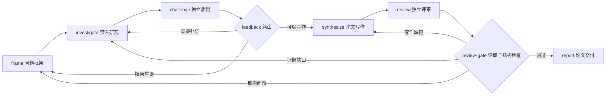

# Anchor

Anchor 是一个以文件、Git 和沙箱为基础的 Agent 工作流系统。用一个 JSON 文件定义图，让节点在各自独立的工作区中执行任务，通过带有 commit 标识的输入交接成果，并在 WebUI 中观察、控制和管理运行。

Agent Node 的内核是 **PydanticAI + pydantic-ai-harness**。Anchor 负责图调度、工作区、沙箱、输入挂载、Git 记录和运行管理；模型负责在节点内部调用工具完成任务。原来的 mini-swe-agent 已被移除。

## 当前能做什么

- **编排工作流**：创建、编辑、校验和保存图；配置 Agent 角色、节点与连线；支持命令节点、条件路由、反馈循环和子图展开。
- **执行与观察**：手动启动工作流，查看运行历史、节点各轮执行、对话、工具调用和产物；文件支持预览和下载，详情面板可调整宽度或最大化。
- **控制与管理**：暂停、继续、停止运行；删除单次运行及其文件；从工作流列表每行的 `⋯` 菜单删除整个图及其全部运行历史。运行中的对象不能删除。
- **持续研究**：内置深度学术调研图，将研究、独立质疑、写作和评审连接成可回流的过程，最终产出学术综述论文。

图就是 `graph.json`，没有图版本发布或不可变版本的管理流程。运行中保存的图副本与节点 Git commit 用于记录执行事实，不是另一套图版本系统。

## 安装与首次启动

以下命令均从仓库根目录执行。

### 1. 准备环境

需要 Linux、Python 3.12+、Git、Bubblewrap（`bwrap`），以及支持 Vite 7 的 Node.js（20.19+ 或 22.12+）。沙箱需要宿主机允许创建相应 namespace；只有安装了 `bwrap`，不代表当前容器或主机一定允许它运行。

```bash
# Debian / Ubuntu：安装系统依赖；Python、Node.js 请另行准备
sudo apt-get install git bubblewrap

python3.12 -m venv .venv
./.venv/bin/python -m pip install -e '.[dev]'
npm --prefix apps/web ci
```

开发、测试和启动服务均使用项目的 `.venv`。如果出现 `No module named pydantic_ai`，先确认使用的解释器和依赖安装位置；PydanticAI 是当前 Agent Node 的正式依赖。

### 2. 配置模型

```bash
mkdir -p .local
cp -n examples/runtime.deepseek.json .local/runtime.json
```

配置文件的有效连接字段如下。`model` 必须是服务商支持的模型名；图中的 `models.academic` 引用这里的 `ref`。

```json
{
  "models": [
    {
      "ref": "models.academic",
      "model": "deepseek-flash",
      "base_url": "https://api.deepseek.com/v1",
      "secret_ref": "DEEPSEEK_API_KEY"
    }
  ]
}
```

当前模型连接使用 OpenAI Chat Completions 兼容接口。密钥通过 `secret_ref` 解析，不写进图文件。可以在启动服务的终端中设置 `ANCHOR_SECRET_DEEPSEEK_API_KEY`；环境变量名称是 `ANCHOR_SECRET_` 加上 `secret_ref`。

也可以使用本地密钥文件：在 `.local/runtime.json` 中增加 `"secret_file": ".local/anchor-secrets.json"`，文件内容为 `{"DEEPSEEK_API_KEY": "你的密钥"}`，权限设为仅当前用户可读写：

```bash
chmod 600 .local/anchor-secrets.json
```

环境变量优先于密钥文件。相对密钥文件路径按进程工作目录解析，因此请从仓库根目录启动。`.local/` 已被 Git 忽略。

### 3. 放入一个工作流

开发服务读取 `.local/demo/workspaces/<图名>/graph.json`。首次使用可以复制深度学术调研示例：

```bash
mkdir -p .local/demo/workspaces/deep-academic-research
cp -n examples/graphs/deep-academic-research.json \
  .local/demo/workspaces/deep-academic-research/graph.json
```

示例文件与实际工作流是两份文件。修改 `examples/graphs/` 不会自动更新已创建的工作流；更新现有图应在 WebUI 中编辑，或明确修改它自己的 `graph.json`。

### 4. 启动后台服务

```bash
./scripts/dev.sh start
./scripts/dev.sh status
```

打开 **http://127.0.0.1:5173**。选择工作流，修改目标并保存，再点击“运行工作流”。

| 服务或文件 | 位置 |
| --- | --- |
| WebUI（Vite） | `http://127.0.0.1:5173` |
| API | `http://127.0.0.1:8077` |
| 工作流与运行数据 | `.local/demo/workspaces/` |
| API 日志 | `.local/dev/anchor-serve.log` |
| WebUI 日志 | `.local/dev/vite.log` |
| 进程 PID 文件 | `.local/dev/` |

**后续开发统一使用这个脚本管理服务**，不要依赖对话框或终端里的前台进程：

```bash
./scripts/dev.sh status
./scripts/dev.sh stop
./scripts/dev.sh restart
```

脚本使用 `nohup` 和 `setsid` 脱离启动终端，关闭终端或对话框不会关闭 Anchor。它不是系统服务管理器，不提供开机自启或进程崩溃后的自动拉起。

前端开发修改由 Vite 加载；Python 后端修改需要重启 API，使用上述 `restart` 会同时重启两个服务。**重启会中断正在执行的节点**；服务启动时会尝试恢复磁盘上仍标记为 `running` 的运行，能否安全恢复取决于节点记录。

如只需构建后的界面：

```bash
npm --prefix apps/web run build
```

`anchor-serve` 会在构建目录存在时提供静态界面，可通过 API 端口访问。自定义数据目录、配置和端口的入口为：

```bash
./.venv/bin/anchor-serve --root /path/to/anchor-data \
  --config /path/to/runtime.json --host 127.0.0.1 --port 8077
```

## WebUI 的使用方式

**图编排**：左侧用于搜索、新建和选择工作流，中间编辑拓扑，右侧修改图、角色或选中节点的属性。保存会调用后端校验；未保存的修改不能直接运行，切换图时会提示是否放弃修改。导入 JSON 是替换当前编辑内容，仍需保存。

编排和运行记录共用画布、节点尺寸、端口与连线路径。自动布局使用 ELK Layered 正交路由，每条边有独立端口；循环返回按入口遍历识别，安排在节点下方。运行只叠加状态和执行次数：已走过的边（包括反馈边）为加粗实线，未走过的边为虚线。轮询不会改变布局。

已有手动位置会保留，拖动结束后由 libavoid 对整图重新避障路由；拖动过程中暂时隐藏连线。点击「自动整理」重新生成布局，支持撤销，保存后生效；适配视图包含回路和标签。选中边可编辑「分支说明」，它保存在 `layout.edgeLabels`（键为 `起点|终点`），位置保存在 `layout.positions`，都只影响显示，不改变调度条件。节点重叠或空间不足的手动布局建议自动整理；复杂图仍可能有必要的交叉。

**工作流管理**：每行的 `⋯` 只管理这一行的图，不需要切换当前编辑对象。桌面悬停或键盘聚焦时显示入口，触屏常显。删除确认会显示图名及删除范围，默认聚焦“取消”。删除另一个图不会丢失当前未保存的编辑。

**运行记录**：选择一次运行，再点击节点查看对话、工具结果和文件。界面通过轮询更新状态；它不是与节点交互的聊天入口，也不是逐 token 的流式聊天。

| 操作 | 行为 |
| --- | --- |
| 暂停 | 当前节点结束后暂停调度 |
| 继续 | 尝试接着原运行执行，不创建新的运行 |
| 停止 | 请求取消当前模型调用或沙箱命令，并停止调度；不必等待节点正常提交 |
| 删除运行记录 | 永久删除该次运行的状态、工作区、Git 历史、对话和其他相关文件 |
| 删除工作流 | 永久删除该图的整个目录，包括图定义和所有运行记录及文件 |

停止是异步取消，后台退出和界面状态更新需要短暂时间。后端在工作线程退出前仍将图视为运行中，期间拒绝删除。删除没有回收站。

## 图、节点与反馈循环

一个最小 Agent 图如下：

```json
{
  "objective": "解释检索增强生成的核心机制与适用边界",
  "agents": {
    "writer": {
      "model": "models.academic",
      "writes": ["answer.md"],
      "instructions": "在 answer.md 中回答问题，明确不确定之处。完成后调用 anchor-done 提交。"
    }
  },
  "nodes": [{"id": "write", "agent": "writer"}],
  "edges": []
}
```

节点有三种声明方式：

| 声明 | 执行方式 |
| --- | --- |
| `{"id": "write", "agent": "writer"}` | Agent Node：模型在自己的工作区中通过 shell 工具完成任务 |
| `{"id": "check", "op": "structure"}` | Op Node：在同样的沙箱中执行一条命令，用退出码判断执行结果 |
| `{"id": "write", "graph": "revision"}` | 子图：运行前展开为普通节点，例如 `write/draft`、`write/review` |

`agents`、`ops` 和可复用的 `graphs` 在文件中声明。节点可以通过 `with` 补充本次使用的指令。子图的 `entry` 和 `exit` 决定外部连线连接的位置；不允许递归包含自身，但执行上的反馈循环是允许的。

Agent 和 Op 都可声明 `reads`、`writes`。加载时会检查声明的读取内容是否存在可达的生产者；这不是对研究结论真实性或产物质量的自动证明。

Agent 完成一轮必须执行明确的提交动作，不能仅回复“已完成”：

```bash
anchor-done --summary "完成了什么，以及还有什么没有完成"
anchor-route --to investigate --reason "核心主张仍缺少能区分竞争解释的证据"
```

有多个出口时必须选择合法的后继节点。Op 的非零退出码表示失败；需要分支的检查节点应把检查结论写入文件，再用 `anchor-route` 选择回流或前进，而不是用失败退出码冒充反馈。

反馈边再次激活节点时，它继续使用本次运行中自己的工作区，读取新反馈，在已有成果上修订，然后留下新的 commit。新一轮是新的节点对话，文件和 Git 历史承担跨轮次的连续性。

### 研究进度不由固定轮数决定

省略图的 `max_rounds`，以及省略 Agent 的 `max_steps` 或将其设为 `null`，都不会设置执行次数上限。深度学术调研示例使用这种方式，让证据、反馈和完成标准决定何时结束。

这些可选字段仍可被显式设置；`max_steps: 0` 表示不允许模型请求。恢复不会清空已经消耗的显式预算，也不会因新配置省略上限而抹掉已持久化的限制。

这不等于所有限制都已移除：当前单条命令有超时，异常模型输出有重试处理，调度器还保留同一节点轮次最多启动 4 次的恢复尝试上限（`MAX_ATTEMPTS`）。后者是现有实现边界，不能据此宣称复杂任务可以无条件无限恢复。

## 工作区、Git 与运行之间的关系

**每次新运行有独立的运行目录和节点工作区，不会自动继承上一条运行历史。** 同一运行里的多轮执行复用节点工作区；恢复原运行也使用原目录。

```text
<服务 root>/workspaces/<图名>/
  graph.json                    当前可编辑的图定义
  runs/<run id>/
    run.json                    调度状态、轮次、路由、输入及 commit 记录
    graph.json                  本次执行写出的图副本，子图已展开
    <node>/                     节点工作区，包含自己的 .git
    control/<node>/             节点恢复、预算与完成记录
    .views/<node>-<commit>/      按指定 commit 导出的输入文件树
    <node>.trace.jsonl           第一轮对话与工具轨迹
    <node>-2.trace.jsonl         第二轮轨迹，以此类推
```

节点在沙箱内写 `/workspace`，读取 `/in/<上游节点>`。Anchor 在沙箱外将一轮执行留下的工作冻结为 Git commit，记录输入来自哪个节点、哪个 commit；节点能读 Git 历史，但自己的 `.git` 在沙箱内是只读的，不应自行提交或改写历史。

**边传递的是 commit 引用，不是把上游文件混入下游工作区。** 运行时仍需要通过 `git archive` 将对应 commit 的文件树导出到 `.views/`，再以只读方式挂载，因此不能把这一机制称为物理上的“零复制”。上游之后继续修改，不会改变已经指定的输入文件树；这保证输入可追溯，不保证模型输出确定性。

下游除了直接输入，还可读取这些输入沿前向依赖关联的上游成果。追溯在反馈边处停止，避免把历次循环全部重新挂载；同一节点只保留一个输入挂载，直接输入优先，其余按执行记录选择较新的轮次。

### 沙箱和工具

所有节点命令通过 Bubblewrap 执行。节点的工作区可写，输入和挂载的系统、工具目录只读；另有临时目录。默认禁用网络，需在 Agent 或 Op 定义中明确设置 `"network": true`。沙箱不可用时不会退回宿主机裸执行。

`anchor-scholarly` 是节点可调用的命令行能力，不是另一个专用学术 Agent 内核。学术调研角色使用同一个 Agent Node，通过指令、网络权限和输入输出声明分工。

以下是节点沙箱内的调用方式；在宿主机手动使用时，将命令名换成 `./.venv/bin/anchor-scholarly`。

```bash
anchor-scholarly sources
anchor-scholarly search --query "retrieval augmented generation evaluation" --source crossref --limit 8
anchor-scholarly search-many --queries-file queries.txt --budget 420
anchor-scholarly read --url "https://arxiv.org/pdf/2005.11401"
anchor-scholarly read-many --urls "https://arxiv.org/abs/2005.11401,https://arxiv.org/pdf/2005.11401"
anchor-scholarly citations --identifier 2005.11401 --direction cited_by
```

搜索源包括 Crossref、arXiv、OpenAlex。结果写入标准输出的 JSON；失败以非零退出码和标准错误报告。长文阅读需使用返回的 `next_offset`、`next_page_start`，分别传给 `--offset`、`--page-start` 继续读取。来源可能限流、拒绝访问或无法提供全文，研究节点需要据此调整策略。

## 深度学术调研图

当前示例是 [deep-academic-research.json](examples/graphs/deep-academic-research.json)。它把研究认知保存在可修订的工作文件中，由质疑和评审决定下一步，而不是预设搜索若干次后直接拼接报告。



- `frame` 首次形成待验证的框架，默认不联网；回访时根据研究与反馈修正问题。首次没有 `/in` 输入是正常的，不能把这一阶段的假设当成已验证结论。
- `investigate` 联网检索、阅读全文和引用链，维护 `research.md`、`sources.md` 与原始材料，记录解释及判断变化。
- `challenge` 独立寻找反例和竞争解释，先验收上一轮问题，再提出影响核心结论的阻断问题。
- `synthesize` 形成 `answer.md`，按问题和机制组织论证；`review` 核查论证、引用、边界以及旧问题是否解决。
- 两个 Op 路由节点将反馈送回能处理问题的节点；最终由 `report` 生成 `runs/<run id>/report/paper.md`。

论文要求包含标题、摘要、引言、调研方法、主题分析、比较分析、开放问题、有效性威胁、结论和参考文献。结构检查验证章节是否存在，不能代替学术评审；自动化测试验证反馈送达、路由和产物结构，不证明真实论文质量。

收敛标准是核心问题得到有证据的回答、重要反例被处理、主张强度与证据一致。可选润色或无关扩展不应阻断交付；证据不足时允许限定或撤回主张，不要求消灭所有未知。

## 命令行、恢复与 HTTP API

### 直接运行与恢复

`anchor-graph` 接收**包含 `graph.json` 的目录**，不是 JSON 文件路径：

```bash
./.venv/bin/anchor-graph .local/demo/workspaces/deep-academic-research \
  --config .local/runtime.json --objective "你的研究问题"

./.venv/bin/anchor-graph .local/demo/workspaces/deep-academic-research \
  --config .local/runtime.json \
  --resume .local/demo/workspaces/deep-academic-research/runs/你的运行ID
```

不要在服务正运行同一个图时再用 CLI 启动它；CLI 不参与服务内的互斥调度。

恢复会同时读取图调度记录和节点持久化记录。无法判断命令是否已经产生副作用时，会报告不确定或失败，不自动猜测并重跑；中断的 Op 尤其不能承诺无条件恢复。服务启动只自动尝试恢复仍标记为 `running` 的记录，不会自动重启已经暂停、停止或失败的研究。

目前恢复仍加载工作流目录中的当前 `graph.json`，并重写运行目录里的展开副本，**并非严格按旧图快照恢复**。需要继续旧运行时，不要先修改该工作流的结构。

### HTTP API

开发环境基址为 `http://127.0.0.1:8077`。同一图一次只运行一个任务，重复触发返回 `409`；不同图可以同时运行，每个图内部目前串行调度节点。

| 方法与路径 | 用途 |
| --- | --- |
| `GET /graphs` | 工作流列表与运行状态 |
| `POST /graphs` | 创建工作流，参数为 `name` 和可选的 `definition` |
| `GET /graphs/<name>` | 读取图定义 |
| `PUT /graphs/<name>` | 校验并保存 `definition`，运行中拒绝修改 |
| `DELETE /graphs/<name>` | 删除图及其全部运行数据，运行中拒绝 |
| `POST /trigger` | 用 `graph` 和可选的 `objective` 启动运行，返回运行 ID |
| `GET /runs` | 列出运行记录 |
| `GET /runs/<id>` | 读取运行状态与节点轨迹摘要 |
| `POST /runs/<id>/pause` | 请求节点完成后暂停 |
| `POST /runs/<id>/stop` | 请求取消当前执行并停止 |
| `POST /runs/<id>/resume` | 尝试继续原运行 |
| `DELETE /runs/<id>` | 删除该次运行及文件，运行中拒绝 |
| `GET /runs/<id>/files/<node>` | 列出节点产物 |
| `GET /runs/<id>/files/<node>/<path>` | 预览文件，加 `?download=1` 下载原文件 |

## 开发与验证

测试使用项目解释器。无需模型服务的测试以脚本模型替代远程调用，仍执行真实调度、沙箱、文件挂载和 Git 提交。

```bash
# 后端测试：排除需要真实服务商的用例；恢复故障测试可能耗时较长
./.venv/bin/python -m pytest -m 'not provider' tests/

# 与图、反馈和管理接口相关的定向检查
./.venv/bin/python -m pytest tests/test_examples.py tests/test_node_controlflow.py tests/test_serve_files.py

# 前端单元测试、浏览器测试和构建
npm --prefix apps/web test
(cd apps/web && npx playwright install chromium)
npm --prefix apps/web run test:e2e
npm --prefix apps/web run build
```

缺少可用沙箱时部分测试会跳过；真实模型用例标记为 `provider`，需要相应配置和密钥。检查通过时应同时看是否存在跳过项，不能把模拟模型的成功视为真实研究验收。

| 目录或文件 | 职责 |
| --- | --- |
| `src/anchor/simple/graph.py` | 图解析、子图展开、输入输出接口校验 |
| `src/anchor/simple/run.py` | 调度、轮次、输入快照、Git 和运行记录 |
| `src/anchor/simple/node_bridge.py` | 调度器到 Agent / Op 运行时的适配 |
| `src/anchor/node/` | 节点契约、PydanticAI 执行、恢复及上下文能力 |
| `src/anchor/runtime/` | 沙箱、命令环境、密钥及学术检索实现 |
| `src/anchor/serve.py` | 工作流、运行、文件和控制 API |
| `apps/web/` | 图编辑与运行观察界面 |
| `examples/graphs/` | 当前图示例；`previous/` 是历史材料，不保证兼容 |
| `tests/`、`scripts/` | 自动化验证、故障实验和后台启动脚本 |

## 当前边界与设计记录

- 节点身份和图拓扑是静态的；尚无运行时动态创建节点或图内并行执行。
- 每次新运行重新执行，不以已有 commit 自动命中节点结果缓存。
- 尚无外部事件驱动、等待人工输入或向现有运行注入文件的完整交互流程。
- 子图可以展开执行，但 WebUI 尚不能进入子图内部编辑；Op 的命令和接口可以查看，修改需通过 JSON。
- 没有图版本发布、共享可写工作区、集中式运行数据库或服务级鉴权。默认面向本机使用。
- 节点层已有上下文管理能力与组合测试，但不能据此假定任意图都已自动启用全部上下文策略，或长研究必然收敛。

[DECISIONS.md](DECISIONS.md) 保存架构决策及被替代的历史方案；[OPEN.md](OPEN.md) 保存设计讨论；[AGENT_NODE_MIGRATION_ACCEPTANCE.md](AGENT_NODE_MIGRATION_ACCEPTANCE.md) 记录 Agent Node 迁移验收。它们包含历史状态，当前使用方式以本 README、当前实现和可运行测试为准。
