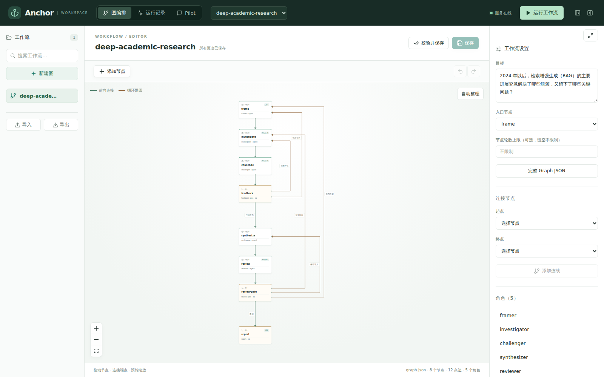
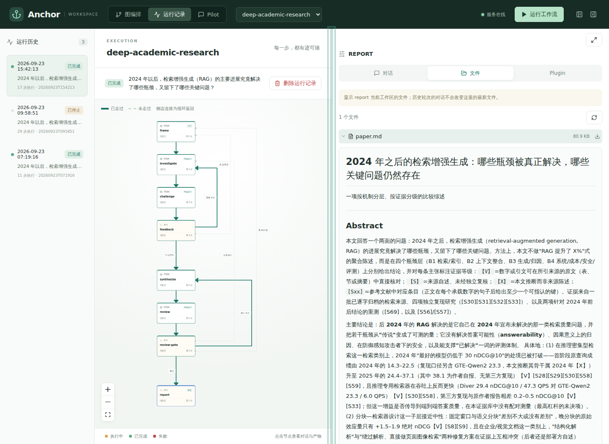

# Anchor

**把复杂工作交给一张图，让每一步都留下证据。**

Anchor 是一个本地优先的 Agent 工作流系统：用 Graph 组织多个 Agent 和确定性操作，用 Plugin 复用能力，用隔离工作区和 Git 保存产物，用 Pilot 通过自然语言查看和管理工作。

它适合需要反复推进、允许质疑和返工、又不能只靠一段聊天记忆的工作：研究、资料整理、代码分析、报告编写，以及以后更多日常事务。

<p align="center">
  
</p>

## 先看一个真实例子

Anchor 附带一张深度学术调研 Graph。它把研究拆成问题构建、检索、质疑、综合、评审和报告几个角色；质疑结果可以把工作送回前面的节点补证，直到评审通过。

运行完成后，Graph、每个节点的执行轮次、对话、工具调用和最终文件都能在同一个界面里回看：

<p align="center">
  
</p>

这里展示的不是演示文字，而是一次实际运行留下的 `paper.md` 产物。Graph 告诉你工作怎样推进，文件和 Git commit 告诉你最后留下了什么。

## Anchor 解决什么问题

普通 Agent 对话擅长即时回答，却很难让人看清长期任务到底做过什么、为什么返工、结果从哪里来。Anchor 把这几件事拆开并连接起来：

```text
Plugin       可复用的方法、知识和工具
   ↓
AgentNode    理解、判断、执行
   + OpNode   确定性的程序步骤
   ↓
Graph        依赖、路由和反馈回路
   ↓
Run          工作区、文件、对话、工具轨迹和 Git 历史
   ↓
Pilot        用自然语言查询、启动和继续工作
```

- **Graph** 是工作流本身：可以有 Agent Node、OpNode、条件路由、反馈循环和子图。
- **Plugin** 是能力资产：说明 Agent 应该怎样做，并按需提供知识和工具入口。
- **Run** 是一次工作的事实记录：每次运行有独立工作区，节点之间通过 commit 对应的只读输入交接。
- **Pilot** 是控制面：可以查询 Graph、Run、Plugin 和产物；聊天中提到的对象可以直接打开。

Agent 使用 PydanticAI，步骤记录和恢复使用 pydantic-ai-harness。Anchor 负责 Graph、工作区、Git、沙箱、Session 和运行生命周期，不另造一套模型循环或聊天记忆系统。

## 当前已经可以做什么

- 在 WebUI 中创建、编辑、校验和保存 Graph。
- 组合 Agent Node、命令型 OpNode、路由、反馈循环和子图。
- 为 AgentNode 挂载 Plugin，按需读取说明并使用共享工具环境。
- 在隔离工作区运行任务，查看对话、工具调用、轮次、文件和 Git 产物。
- 暂停、继续、停止和删除运行记录；在原会话里让 Pilot 查询或管理资源。
- 服务或进程中断后重新打开 Session，加载 Harness 工作记录继续；缺失的工具结果会如实标记为中断，不盲目重放。
- 通过聊天里的 Graph、Run、Artifact 链接直接跳到已有页面。

现在的触发入口是手动/API 的 `POST /trigger`。定时、邮件、文件变化等外部事件触发，以及更丰富的常驻 Graph，还在后续产品讨论中。

## 从一个 Graph 开始

Graph 就是一个 JSON 文件。下面的例子让一个 Agent 写出结果，再由命令节点检查文件：

```json
{
  "entry": "write",
  "objective": "整理一份关于 RAG 的简短说明",
  "agents": {
    "writer": {
      "model": "models.academic",
      "writes": ["answer.md"],
      "instructions": "读取任务，写出 answer.md，并返回结构化完成结果。"
    }
  },
  "ops": {
    "check": {
      "reads": ["answer.md"],
      "run": "test -s /workspace/answer.md"
    }
  },
  "nodes": [
    {"id": "write", "agent": "writer"},
    {"id": "check", "op": "check"}
  ],
  "edges": [{"from": "write", "to": "check"}]
}
```

更完整的示例：

- [深度学术调研 Graph](examples/graphs/deep-academic-research.json)
- [带 Plugin 的调研 Graph](examples/graphs/plugin-research.json)
- [Plugin 设计与格式](docs/plugins.md)

## 安装和运行

需要 Linux、Python 3.12+、Git、Bubblewrap，以及 Node.js 20.19+ 或 22.12+。

```bash
python3.12 -m venv .venv
./.venv/bin/python -m pip install -e '.[dev]'
npm --prefix apps/web ci

mkdir -p .local
cp -n examples/runtime.deepseek.json .local/runtime.json
# 设置 ANCHOR_SECRET_DEEPSEEK_API_KEY，或按 docs/usage.md 配置本地密钥文件

mkdir -p .local/demo/workspaces/deep-academic-research
cp -n examples/graphs/deep-academic-research.json \
  .local/demo/workspaces/deep-academic-research/graph.json

./scripts/dev.sh start
```

打开 <http://127.0.0.1:5173>，选择 Graph，保存后运行。完整的模型配置、沙箱依赖、服务管理和恢复说明见 [使用指南](docs/usage.md)。

## 项目边界

Anchor 目前是面向本机的单服务进程产品。它不承诺任意外部副作用 exactly-once，也不把研究结论自动判定为正确；运行记录提供证据，最终判断仍由用户和具体 Graph 负责。

计划中的系统级 Pilot、事件触发、附件和资源引用、编辑分支与导出、研究应用层体验，都会在当前核心运行链稳定后分别讨论。它们不是使用 Anchor 的前置条件。

## 文档

| 文档 | 内容 |
| --- | --- |
| [使用指南](docs/usage.md) | 安装、配置、启动、编排、运行和恢复 |
| [当前架构](docs/architecture.md) | Graph、Run、工作区、Git、沙箱和当前实现边界 |
| [产品与系统架构](docs/product-architecture.md) | 产品对象、原则和后续方向 |
| [Plugin 设计](docs/plugins.md) | Plugin 格式、工具环境和能力边界 |
| [Pilot 开发计划](docs/pilot-development-plan.md) | 当前阶段、验收矩阵和证据台账 |

## 开发

```bash
./.venv/bin/python -m pytest -q -n 8 --dist worksteal
npm --prefix apps/web test
npm --prefix apps/web run test:e2e
npm --prefix apps/web run build
```

Anchor 使用 MIT License，见 [LICENSE](LICENSE)。
