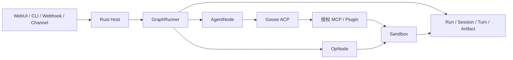

# Anchor

<p align="center">
  <strong>用 Graph 组织 Agent 的长期工作，让每次执行都可观察、可恢复、可交付。</strong>
</p>

<p align="center">
  <a href="LICENSE"></a>
  <a href="rust/Cargo.toml"></a>
  <a href="apps/web/package.json"></a>
  <a href="docs/architecture.md"></a>
</p>

<p align="center">
  <a href="#快速开始">快速开始</a> ·
  <a href="#核心概念">核心概念</a> ·
  <a href="#示例">示例</a> ·
  <a href="#文档导航">文档</a> ·
  <a href="#开发与验证">开发</a>
</p>

Anchor 是一个本地优先、可观察、可恢复的 Agent 工作系统。你用 **Graph** 描述任务拆分、检查、返工和交付；用 **AgentNode** 处理需要理解和取舍的工作；用 **OpNode** 执行确定性步骤；用 **Plugin** 提供明确授权的知识、工具和外部系统连接。

每次 **Run** 都会冻结 Graph 定义、输入和资源绑定，并保存节点历史、工具观察、工作区和不可变 Artifact。**Session/Turn** 负责持续协作、必要提问、事件重连和入口幂等。服务中断后，Anchor 先保存事实，再让 Agent 核查现场并继续；它不会把未知的外部副作用当成可以安全重放的操作。

> **当前状态**  · Anchor 正在持续开发，当前维护路径是 Rust Host + 共享 Runtime Kernel + Goose ACP + React/TypeScript WebUI，默认面向 Linux x86_64 的本地单进程部署。核心运行链有确定性本地回归；真实模型、真实 WeCom/Docmost/学术服务、目标机发行、旧数据迁移和生产切换按独立验收记录，详见[开发台账](docs/pilot-development-plan.md)。

<p align="center">
  
</p>

## 为什么使用 Anchor

| 关注点 | Anchor 的做法 |
| --- | --- |
| 复杂任务如何拆分 | Graph 把 Agent 推理、确定性操作、条件路由、反馈、子图和并行分支放在同一份可编辑定义里。 |
| 结果如何复查 | Run 记录实际路径、每次 invocation、工具请求与结果、工作区和 Artifact；UI 只是这些事实的投影。 |
| 中断后如何继续 | Goose 保存原生 Agent loop、Provider、会话和 compaction；Anchor 保存 Graph cursor、权限、产物和恢复事实。继续前先核查现场，不自动重放未知副作用。 |
| 能力如何受控 | Plugin、Library、MCP 和 Bubblewrap Sandbox 由 Host 显式绑定和授权；模型输出、提示词和 Plugin 描述本身不增加权限。 |

## 核心概念

| 对象 | 作用 |
| --- | --- |
| **Graph** | 可编辑的任务定义，包含节点、边、目标、输入接口和画布布局；开始运行后会形成自己的冻结快照。 |
| **AgentNode** | 负责理解、搜索、综合、判断和结构化完成；通过固定版本 Goose ACP 与模型交互。 |
| **OpNode** | 负责命令、Graph Call、`fanout/join` 或获授权的 Host operation；适合需要代码严格控制的步骤。 |
| **Plugin** | 一组 Skill、资源、MCP 工具或渠道入口；安装到 Library 后由 Graph 显式引用。 |
| **Run** | 一次实际执行，拥有 cursor、工作区、工具观察、节点历史、Artifact、控制和恢复事实。 |
| **Session / Turn** | 持续对话和单次输入的身份边界，提供幂等请求、SSE 事件游标、必要提问和渠道投递事实。 |

### 一次执行如何发生


```mermaid
flowchart LR
    A[WebUI / CLI / Webhook / Channel] --> B[Rust Host]
    B --> C[GraphRunner]
    C --> D[AgentNode]
    C --> E[OpNode]
    D --> F[Goose ACP]
    F --> G[授权 MCP / Plugin]
    G --> H[Sandbox]
    E --> H
    C --> I[Run / Session / Turn / Artifact]
    H --> I
```

Goose 拥有 Agent loop、Provider、原生会话和上下文压缩；Anchor 拥有 Graph、Run、Artifact、Sandbox、Library 和平台 Session/Turn。两者通过稳定的 ACP、MCP 和节点执行端口协作，Anchor 不再维护第二套通用 Agent loop。

## 能力地图

| 能力 | 当前入口 | 说明与边界 |
| --- | --- | --- |
| Graph 编辑与执行 | WebUI、Graph API | 创建、校验、条件路由、反馈、内联子图、独立 Graph Call、`wait/detach`、配对 `fanout/join`。 |
| Run 观察与控制 | Run 页面、API | 查看路径、节点对话、工具轨迹、文件和 Artifact；支持暂停、停止、继续、历史和受保护删除。 |
| Pilot Session | WebUI、Session API | 持续对话、SSE 重连、必要提问与回答、原生会话续聊和压缩；Responses 仅实现文档列出的子集。 |
| Plugin 与工具 | Library、MCP、Sandbox | 支持 Skill、资源、stdio/HTTP MCP、凭据引用和 OAuth 基础；权限由 Host/Sandbox 强制校验。 |
| 触发与渠道 | 手动、计划、Webhook、Responses、WeCom | 入口共用同一 Run 接纳；WeCom 使用 Host 监管的原生 Gateway，具体公网能力仍按真实环境验收。 |
| 官方工具 | `anchor-scholarly`、`anchor-docmost-tools`、`anchor-wecom-tools` | Rust 官方工具作为显式 Plugin 资源进入 Graph 闭包，外部服务凭据和业务结果不随仓库提供。 |
| 独立交付 | `anchor-distribution`、systemd | 构建 source-free Graph/Plugin 闭包，状态、凭据和可写根目录留在发行包之外。 |

## 快速开始

### 运行方式与环境要求

从源码开发和运行预构建发行包使用同一套 Host 与 Runtime，所需环境有所不同：

| 依赖 | 从源码构建与开发 | 运行完整发行包 |
| --- | --- | --- |
| Linux x86_64 | 需要 | 需要，并满足包内二进制的系统兼容要求 |
| Rust stable、`rustup` | 构建 Rust 和固定 Goose 时需要 | 不需要 |
| Node.js、npm | 构建 WebUI、运行 Vite 时需要；Node.js 20.19+ 或 22.12+ | 不需要；Rust Host 直接提供编译后的 WebUI |
| Git、`sh`、Bubblewrap | 需要，沙箱须有可用的 user/mount/network namespace | 同样需要 |
| 固定 Goose ACP 二进制 | 按下文脚本构建并配置 | 发行包已包含 `bin/goose` |
| 系统动态库 | 满足所构建 ELF 的依赖 | 按 `runtime-manifest.json` 中 Host 和工具的 ELF 依赖准备 |
| 模型与外部服务配置 | 运行相应 Agent/Plugin 时需要 | 同样需要；凭据和状态放在包外 |

### 使用预构建发行包

完整 `anchor-runtime/` 包包含 Host、固定 Goose、Graph bundle 和声明的 Plugin 资源；使用 WebUI 的包还需包含编译后的 `web/`。安装环境满足上表后，配置包外的数据目录、权限和模型，再直接运行 `bin/anchor-runner-host serve`，或交给 systemd 管理。部署步骤见[生产部署指南](docs/rust-production-deployment.md)。

只有一个 `anchor-runner-host` 可执行文件时，还需要配齐 Goose、Graph/Plugin 资源和所需 Web 资产。官方发行不依赖 Python；第三方 Plugin 若使用其他语言，其运行环境由该 Plugin 的声明决定。Goose 是静态 musl 二进制，Host 和工具仍可能依赖动态库，具体以发行 manifest 为准。

`scripts/dev.sh` 会运行 Node 并启动 Vite，适用于下面的开发路径；成品包直接运行 Host 时不使用该脚本，也无需在目标机重建 Goose 或 WebUI。

### 从源码启动本地开发服务

```sh
npm --prefix apps/web ci
cp .env.example .env

# 先启动不调用模型的 dev Graph；它包含一个确定性的 true Op。
./scripts/dev.sh start
./scripts/dev.sh status
```

打开 <http://127.0.0.1:5173> 使用 Vite 开发界面，或打开 <http://127.0.0.1:8077> 使用 Rust Host 提供的 WebUI/API。`scripts/dev.sh` 使用独立的 `.local/rust` 数据根，不会接管仓库里已有的 Graph、运行记录或环境。

停止或重启服务：

```sh
./scripts/dev.sh stop
./scripts/dev.sh restart
```

### 从源码启用 AgentNode 与 Pilot

先构建仓库固定的 Goose v1.53.0 lean ACP 二进制。脚本会固定上游源码、musl 工具链和 SHA256，并检查静态 ELF；首次构建需要网络和几分钟时间。

```sh
mkdir -p .local/bin
scripts/build-goose-acp.sh \
  --check-reproducible \
  --output "$PWD/.local/bin/goose"
```

然后编辑 `.env`，至少填写：

```dotenv
ANCHOR_GOOSE_BINARY=/absolute/path/to/Anchor/.local/bin/goose
ANCHOR_GOOSE_BINARY_SHA256=71e76c412597b2ecd96ed20d0706e7666f31c018216e7cb5d65c5ca5c44824a7
ANCHOR_GOOSE_ALLOW_SHARED_NETWORK=1
ANCHOR_MODEL_URL=https://provider.example/v1
ANCHOR_MODEL_API_KEY=replace-me
ANCHOR_MODEL_NAME=replace-me
ANCHOR_MODEL_WIRE_API=responses
```

保存后执行 `./scripts/dev.sh restart`。示例 Graph 中的 `models.academic` 在没有单独配置别名时会回退到 `ANCHOR_MODEL_NAME`；需要区分不同模型时再设置 `ANCHOR_MODEL_ALIASES`。凭据只放在部署环境；不要写入 Graph、Plugin、发行包或 Git。完整配置、监听地址、API key 和各数据根见[使用指南](docs/usage.md)。

### 第一次运行开发示例

1. 在 WebUI 打开 `dev` Graph，确认 Host 和 WebUI 都处于 ready。
2. 运行内置的 `true` Op，查看 Run 的路径和完成状态。
3. 配置 Goose 和模型后，先导入不依赖外部 Plugin 的 `examples/graphs/revise-loop.json`，观察 AgentNode、Artifact 和反馈路径。
4. 需要精确的 Graph API 导入格式时，按[使用指南中的 Graph 小节](docs/usage.md#graph-与-webui)操作；Graph 保存时会校验作者定义和 Plugin 资源绑定。

## 示例

仓库中的 Graph 都是普通 Graph，不依赖另一套业务执行器：

| 示例 | 用途 |
| --- | --- |
| [`one-search.json`](examples/graphs/one-search.json) | 单 Agent 的最小检索示例。 |
| [`revise-loop.json`](examples/graphs/revise-loop.json) | 草稿、审阅和返工反馈回路。 |
| [`parallel-audit.json`](examples/graphs/parallel-audit.json) | 两个独立审查分支通过 `fanout/join` 汇总。 |
| [`survey-modular.json`](examples/graphs/survey-modular.json) | 以内联子图复用一段工作流。 |
| [`deep-academic-research.json`](examples/graphs/deep-academic-research.json) | 带调查、挑战、综合、评审和门禁的研究 Graph。 |
| [`rsi.json`](examples/graphs/rsi.json) | 通过证据、评审和确定性门禁生成演进提案；发布提案不会自动修改项目。 |
| [`wecom-persistent-assistant.json`](examples/graphs/wecom-persistent-assistant.json) | 可选的同 Run 多轮企业微信助手；不会原地替换一次性助手 Graph。 |

`one-search.json`、`deep-academic-research.json` 和其他学术示例还需要先安装 `academic-research` Plugin，并为 Host 提供相应的外部学术服务配置；安装方式见 [Plugin 指南](docs/plugins.md)。它们不属于只启动本地 dev Graph 就能完成的最小示例。

<p align="center">
  
</p>

## 安全、恢复与部署边界

Anchor 的安全模型依赖可核查的事实和明确的授权边界：

- Graph、Run、Session、Artifact、Library 和 Sandbox 各自拥有稳定事实；UI 缓存、摘要和模型上下文不是权威状态。
- 每个 Run 冻结 Graph、Plugin 和输入授权；Graph 或 Library 后续更新不会静默改变已经开始的 Run。
- 外部工具返回缺失、进程中断或发送结果未知时，系统保存观察事实，让 Agent 核查工作区和外部状态，再决定继续、补偿或提问。
- 不自动重放未知的外部操作，也不承诺外部副作用的 exactly-once；重启后恢复保存的事实，不重放旧确认。
- Plugin 清单和提示词不等于权限。文件、命令、网络、凭据和控制动作由 Host、Library 和 Bubblewrap Sandbox 共同校验。
- 默认部署是本机单服务进程，不是托管云服务或多租户工作流集群；非 loopback 监听必须自行配置身份、网络边界和 Bearer key。

生产发行需要先构建并审查 source-free 包，再由 systemd 使用包外的 state、workspace、catalog 和凭据目录。请按[生产部署指南](docs/rust-production-deployment.md)和[候选回归](docs/rust-production-candidate.md)操作；本地回归通过不等于生产流量、旧数据或公网业务已经切换。

## 仓库结构

```text
rust/             Rust Cargo workspace：Runtime、Host、官方工具、发行与开发检查
apps/web/         React/TypeScript WebUI、单元测试和浏览器测试
plugins/          官方 Plugin 清单、Skill、资源和渠道声明
examples/         Graph、独立 bundle 和 RSI 示例
deploy/           systemd unit 与受保护环境模板
scripts/          本地服务管理与固定 Goose 构建脚本
docs/             使用、架构、验收台账、部署和历史归档
```

## 文档导航

| 你想了解什么 | 从这里开始 |
| --- | --- |
| 安装、配置、Graph、Run 和 Session | [使用指南](docs/usage.md) |
| 当前 Rust 实现和事实所有者 | [当前架构](docs/architecture.md) |
| 产品边界、执行不变量和设计原则 | [产品与系统架构](docs/product-architecture.md) |
| Plugin、Skill、MCP 和授权资源 | [Plugin 指南](docs/plugins.md) |
| 确定性 Runtime 回归与证据格式 | [小型 Graph 回归](docs/runtime-contract-tests.md) |
| source-free 包和 systemd | [生产部署](docs/rust-production-deployment.md) |
| Web API、状态、错误和事件游标 | [Web API 契约](docs/rust-frontend-api-contract.md) |
| 企业微信助手和渠道边界 | [企业微信指南](docs/wecom-assistant.md) |
| 实际完成状态、证据和未验收项 | [开发台账](docs/pilot-development-plan.md) |
| 早期设计和迁移记录 | [历史归档](docs/archive/README.md) |

完整索引见[文档目录](docs/README.md)。

## 开发与验证

后端和官方工具使用 Rust，前端使用 React/TypeScript。开始改动前请阅读 [AGENTS.md](AGENTS.md) 和[开发指南](docs/development.md)，并先运行与改动直接相关的检查。

```sh
# Rust workspace
cargo +stable test --manifest-path rust/Cargo.toml --workspace --all-features --all-targets --locked
cargo +stable clippy --manifest-path rust/Cargo.toml --workspace --all-features --all-targets --locked -- -D warnings
cargo +stable fmt --manifest-path rust/Cargo.toml --all -- --check

# WebUI
npm --prefix apps/web test
npm --prefix apps/web run build
```

需要验证实际 Host、GraphRunner、Goose ACP、MCP、Sandbox 和 Artifact 时，使用固定 Goose 与确定性本地 Provider 的回归入口：

```sh
ANCHOR_GOOSE_BINARY=/absolute/path/to/goose \
cargo +stable run --manifest-path rust/Cargo.toml -p anchor-devtools --locked -- \
  regression goose-fixture --evidence-root /tmp/anchor-goose-regression
```

该回归不调用真实模型、不发送公网消息，也不证明外部业务内容质量；缺少 Goose、浏览器或外部凭据时，跳过/未配置必须按未验收处理。验证命令和证据边界以[回归指南](docs/runtime-contract-tests.md)与[开发台账](docs/pilot-development-plan.md)为准。

## 许可证

Anchor 使用 [MIT License](LICENSE)。
