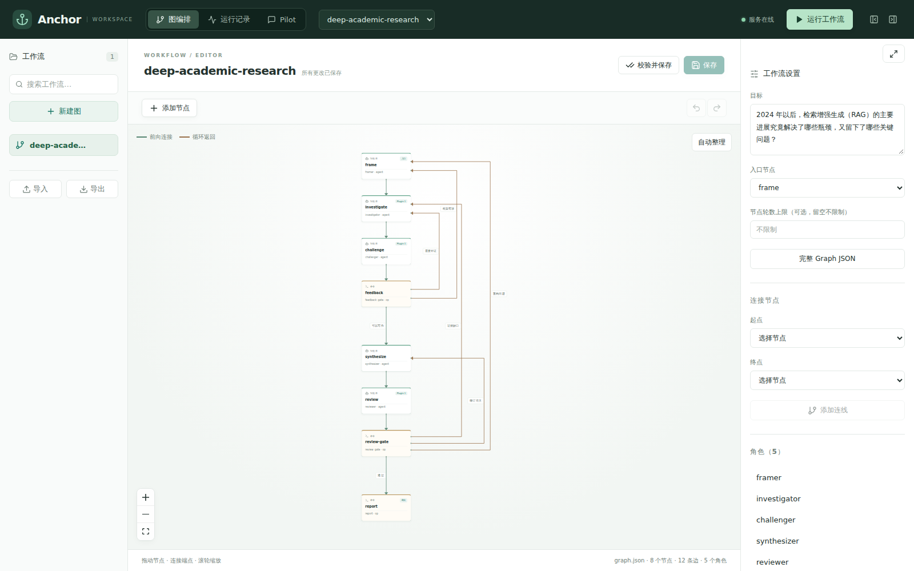
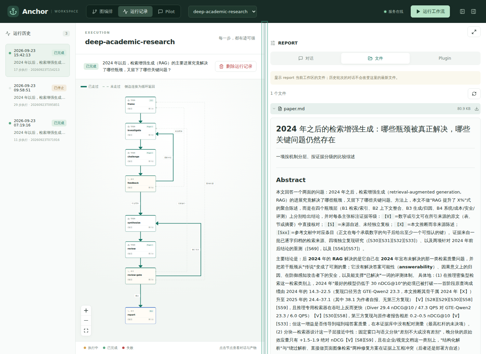

# Anchor

**让 Agent 在一张图里完成长期工作，并让每一步都能回看。**

Anchor 是一个本地优先的 Agent 工作流运行时。你用 Graph 描述任务如何拆分、检查、返工和交付；AgentNode 负责理解与执行，OpNode 负责确定性步骤，Plugin 提供可复用的知识和工具。每次 Run 都拥有独立工作区、文件、Git 快照和工具轨迹。

它适合研究、资料整理、代码分析、报告编写和企业内部助手这类需要多轮推进、允许返工、又不能只依赖聊天记忆的工作。

<p align="center">
  
</p>

## 你会得到什么

普通 Agent 对话更适合即时回答；Anchor 更关注一项工作如何完成：

- 工作被拆成可观察的 Graph，而不是藏在一段长提示词里。
- Agent 和确定性程序可以放在同一条流程中。
- 反馈可以把任务送回前面的节点，继续补证或返工。
- 节点之间通过提交后的只读文件交接，产物不会悄悄覆盖。
- 每次 Run 都保留对话、工具调用、文件、轮次和 Git 历史。
- 服务或进程中断后，Agent 可以读取已保存的工作记录，核查现场后继续。
- Pilot 可以用自然语言查询 Graph、Run、Plugin 和产物。

一次实际运行的结果如下：

<p align="center">
  
</p>

## 核心对象

```text
Plugin       可复用的方法、知识和工具
   ↓ 挂载
AgentNode    理解、判断和执行
OpNode       确定性的命令或服务操作
   ↓ 组织
Graph        依赖、路由、反馈和子图
   ↓ 执行
Run          工作区、文件、对话、工具轨迹和 Git 快照
   ↓ 查询
Pilot        用自然语言查看和管理工作
```

Graph 是 JSON 文件；Plugin 是独立能力资产；Run 是一次工作的事实记录。Anchor 使用 PydanticAI 和 Harness 处理 Agent 调用、步骤记录与恢复，自己负责 Graph、工作区、Git、沙箱、Session 和运行生命周期。

## 当前可用

- WebUI 创建、编辑、校验和运行 Graph。
- AgentNode、OpNode、条件路由、反馈循环和子图。
- Plugin 的 Skill、资源、stdio MCP 和 HTTP MCP。
- Bubblewrap 隔离工作区、只读输入和网络权限控制。
- 运行详情中的节点对话、工具事件、文件和 Git 产物。
- 运行暂停、继续、停止、恢复和删除。
- Pilot Session、流式事件、必要提问和中断后续聊。
- Graph 之间的独立 Run 调用，可等待结果或后台运行。
- 企业微信智能机器人 WebSocket 长连接、跨用户私聊、附件、持续回复和主动消息。
- 安装 Monty 后，AgentNode 自动使用 CodeMode 批量调用普通 Plugin/MCP 工具；Graph 不需要增加配置。

## 5 分钟启动

需要 Linux、Python 3.12+、Git、Bubblewrap，以及 Node.js 20.19+ 或 22.12+。

```bash
# 在仓库根目录执行
python3.12 -m venv .venv
./.venv/bin/python -m pip install -e '.[dev]'
npm --prefix apps/web ci

cp .env.example .env
# 编辑 .env，至少填写：
# ANCHOR_MODEL_URL
# ANCHOR_MODEL_API_KEY
# ANCHOR_MODEL_NAME

mkdir -p .local/demo/workspaces/deep-academic-research
cp examples/graphs/deep-academic-research.json \
  .local/demo/workspaces/deep-academic-research/graph.json

./scripts/dev.sh start
```

打开 <http://127.0.0.1:5173>，选择 `deep-academic-research`，保存并运行。运行结束后可以在 WebUI 中查看 Graph 路径、节点对话、工具调用和 `paper.md`。

服务管理：

```bash
./scripts/dev.sh status
./scripts/dev.sh restart
./scripts/dev.sh stop
```

完整配置、恢复行为和常驻部署见 [使用指南](docs/usage.md)。

## 接入企业微信

企业微信是一个普通 Plugin + 长驻通道，不需要把 Anchor 部署到企业微信客户端所在的机器。Anchor 通过官方智能机器人 WebSocket 连接企业微信，再把私聊消息交给 `wecom-assistant` Graph。

安装通道依赖并创建助手 Graph：

```bash
./.venv/bin/python -m pip install -e '.[channels,mcp,codemode]'
./.venv/bin/python plugins/wecom/setup.py --root .local/demo
```

在 `.env` 填写 Bot ID、Secret、Anchor API key、允许的企业微信 userid 和模型配置，然后检查：

```bash
./.venv/bin/python plugins/wecom/setup.py --root .local/demo --check
./scripts/dev.sh restart
```

同一个用户的消息会进入独立 Session；不同用户可以并发；新消息可以中断上一轮并接着历史继续。完整凭证、权限、图片/文件和网关说明见 [企业微信助手接入](docs/wecom-assistant.md)。

## Plugin 和 CodeMode

Plugin 目录可以包含 Skill、资源和 MCP server。AgentNode 只引用 Plugin ID，运行时负责只读挂载、沙箱边界和工具连接。

CodeMode 是内部执行优化，不是 Graph 配置项。安装 `codemode` 后，真实 provider 的 AgentNode 自动使用 Harness 的 `tools='all'`；Agent 可以在一次 `run_code` 中批量调用已发现的普通工具并整理结果。Tool Search、Bash 和框架控制工具保持原生路径；没有 Monty 时自动回退到普通工具调用。

## 数据和边界

```text
.local/demo/
├── library/                 Plugin 和共享工具
├── state/                   Session、事件、计划和步骤记录
└── workspaces/<graph>/
    ├── graph.json           当前 Graph 定义
    └── runs/<run>/           一次运行的状态、节点工作区和产物
```

Anchor 当前面向本机单服务进程。它不承诺任意外部副作用 exactly-once，也不自动判定研究结论正确；运行记录提供可追溯证据，具体 Graph 和用户负责最终判断。企业微信审批、外部业务系统权限和更复杂的多租户部署需要对应 Plugin 和产品契约，目前不属于通用运行时的默认能力。

## 文档

| 文档 | 适合谁 | 内容 |
| --- | --- | --- |
| [使用指南](docs/usage.md) | 使用者和部署者 | 安装、配置、启动、编排、运行和恢复 |
| [企业微信助手接入](docs/wecom-assistant.md) | 企业微信接入者 | 凭证、WebSocket、Session、附件和权限 |
| [Plugin 设计](docs/plugins.md) | Plugin 开发者 | Skill、资源、MCP、沙箱和 CodeMode |
| [当前架构](docs/architecture.md) | 开发者 | Graph、Run、工作区、Git、沙箱和当前边界 |
| [产品与系统架构](docs/product-architecture.md) | 设计和规划 | 产品对象、原则和后续方向 |
| [开发台账](docs/pilot-development-plan.md) | 贡献者 | 阶段、验收矩阵和证据记录 |

## 开发

```bash
./.venv/bin/python -m pytest -q -n 8 --dist worksteal
npm --prefix apps/web test
npm --prefix apps/web run test:e2e
npm --prefix apps/web run build
```

Anchor 使用 MIT License，见 [LICENSE](LICENSE)。
