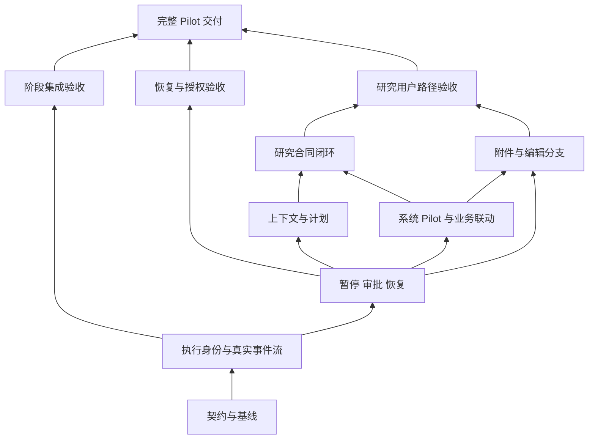

# Anchor Pilot 开发计划与验收台账

2026-09-26。基线：[体验核查](pilot-experience-audit.md)。产品目标以 [产品与系统架构](product-architecture.md) 为准，当前实现以 [当前架构](architecture.md) 为准；本文是开发顺序、阶段契约和验收状态的唯一台账。

## 交付目标与范围

用户可以在一个持久会话中提出问题、查看真实执行过程、补充信息或批准原始操作、管理研究工作流、检查有来源的产物，并在断网、刷新、停止或服务重启后理解和恢复工作。达到这个体验不要求复制 Codex/Claude Code 全部能力。

必做：可恢复执行身份、真实流式文本与工具记录、用户等待/审批、所有副作用的恢复边界、长对话上下文与计划、系统 Pilot 定义、Graph/Run/产物联动、研究合同及验收、受控附件、消息编辑分支、完整真实路径验收。

不做：自造模型循环、第二个 Graph 调度器、宿主 Shell/FileSystem 绕过沙箱、多租户平台、知识库自动编译、自动环境安装、无需求的云端持久工作流集群。默认部署仍是本机单个服务进程；多进程互斥不能靠实例内锁冒充。

## 分阶段工作包

比例表示相对工程工作量，不表示完成百分比或时间承诺。共享契约由主集成者维护，当前仓库含大量既有未提交修改，不 reset、不清理、不把它们自动纳入提交。

| 阶段 | 工作量 | 交付与主要路径 | 依赖 | 可独立验证与停止条件 | 状态 |
| --- | ---: | --- | --- | --- | --- |
| P0 计划与契约 | 5% | 本文、需求矩阵、协议取舍与数据所有权 | 现状核查 | 能解释每个缺口落在哪阶段，未完成项不漏报 | 已建立 |
| P1 执行身份与事件流 | 20% | `turn_id` / `request_id`、后台执行、持久 Vercel UI chunks、SSE 重连、真实增量文本与工具卡片 | P0 | 重复提交不重复调用；刷新/断网后接回同一 turn；停止保留部分输出；进程重启不自动重放 | 已完成（后端 + 浏览器证据） |
| P2 暂停、审批与恢复 | 25% | Pydantic deferred tools、Harness StepPersistence、call ID 账本、资源 CAS、状态事务与历史迁移 | P1 | 多个待确认不覆盖；确认/拒绝绑定原调用；工具后崩溃不重做；未知结果可明确处置 | 进行中（deferred 审批、提问暂停、按 call ID 记账与资源前态比较已完成；未知结果的处置入口与跨存储事务待做） |
| P3 长任务上下文与计划 | 10% | 压缩/摘要/占用事件、持久 Planning、运行中输入排队与生效点 | P2 | 长对话保留目标/决定/证据；真实计划可见；排队输入只送一次；无固定轮数伪装完成 | 未开始 |
| P4 系统 Pilot 与业务联动 | 15% | 实际参与执行的系统 Pilot 定义、受控控制 Plugin、Graph/Run/Artifact 卡片与往返导航 | P2 | 禁止普通修改/删除系统 Pilot；权限不扩张；聊天跳转实际运行和文件后可回到原会话 | 未开始 |
| P5 研究合同闭环 | 10% | 结构化合同、用户确认、版本变更等待、运行绑定、逐项证据验收 | P3 + P4 | 问题/范围/排除范围/交付/证据/结束条件可审阅；变更不偷偷改题；不凭模型自评判定交付 | 未开始 |
| P6 完整会话操作与附件 | 5% | 编辑后分支、归档管理/导出、受控文件图片上传、能力与格式限制 | P2 + P4 | 分支不复制外部副作用；附件越界/非法类型拒绝；引用和下载来自持久资源 | 未开始 |
| P7 集成验收与交付 | 10% | 迁移、负向权限、真实 provider、桌面/移动浏览器、故障注入、全量回归和文档 | 各阶段逐次进入 | 全部 MUST 有证据，未验收不能称为 Pilot 完成 | 持续进行 |

内聚/独立性判断（1–5，高为强）：P1 与 P2 内聚 5、独立性 1，共享 Session/API/UI，顺序集成；P3/P4 在 P2 稳定后内聚 4、独立性 3；P5/P6 依赖业务和状态契约，之前不并行开工。独立审查重点攻击状态一致性、授权和重放窗口，不以实现者自测代替审查。



## 冻结的共享契约

### 身份与事实来源

- Session 是长期对话；turn 是一次已接收的用户提交/恢复尝试；Graph Run 是独立业务运行，三者不复用 ID。
- 客户端每次提交生成 `request_id`，网络重试沿用。服务端在同一 Session 下幂等接收；同 ID 不同内容返回 409。同 Session 同时只有一个运行中的 turn。
- `conversation_id = Session.conversation_id`；每次模型执行以新 `turn_id` 传给 PydanticAI `run_id`，恢复尝试不复用原 framework run ID。
- Harness 保存权威模型消息与后续步骤记录；Anchor 保存会话生命周期、提交意图、执行身份、用户授权、业务关联和审批前态。浏览器草稿与当前选择只作本地交互缓存。
- P1 的 SQLite turn 表及事件表是提交/执行状态和传输游标的权威，事务约束请求去重。事件内容直接使用 PydanticAI `VercelAIEventStream(sdk_version=6)` 输出的 chunks，不自造模型事件格式。已完成对话以 Harness 为准；部分流是未完成展示记录，不直接塞回模型历史。
- Session 旧 JSON/JSONL 暂时保留，P2 才收敛生命周期/审批/操作账本事务并做显式迁移；不借 P1 宣称双存储已原子。

### API 与流式传输（P1）

```text
POST /sessions/<id>/turns
  {"request_id":"稳定提交 ID", "message":"用户输入"}
  或 {"request_id":"新的恢复尝试 ID", "resume":true}
  → 202 {"turn":{...}}；重试已有 request 返回同一 turn；冲突 409
GET  /sessions/<id>/turns                 → turn 列表（不含模型消息）
GET  /sessions/<id>/turns/<turn>/events   → text/event-stream
  Last-Event-ID 或 ?after=<序号>；只返回指定 Session 的指定 turn
POST /sessions/<id>/stop                 → 请求取消当前执行
```

SSE `message` 的 data 为标准 Vercel chunk，`id` 为已提交到 SQLite 的事件序号；另有 `turn` 命名事件报告 Anchor turn 终态。重连只补游标后的记录。订阅是只读；关闭页面不会启动新模型请求，也不会取消服务端任务。停止必须显式请求。

保留现有同步 `/messages` 与 `/resume` 供原调用方，交互 UI 转用后台 turn API；两条入口共享 Pilot 执行器与取消门禁，不引入第二套业务工具。P2 收敛审批恢复后再统一旧入口的完整请求去重。

### 状态、取消、失败

- turn：`running → completed | failed | stopped | interrupted`；P2 增加持久等待边界。
- 服务启动发现上一进程遗留的 `running` turn，标为 `interrupted`，保留事件、输入意图和错误说明，禁止自动重放副作用。
- 浏览器不把断开连接当作执行失败；连接恢复重新读取状态/历史。提交响应丢失用同一 request ID 查询/重试，不生成第二次执行。
- P1 只有没有进入有副作用工具的失败执行可以通过现有续答机制重试；涉及副作用且未完成步骤恢复的执行保守拒绝，P2 提供正式处置与恢复路径。
- 最终模型消息保存成功后才能将 turn 标为 completed；两者之间崩溃时保守报告中断，不重新声称副作用从未发生。

### P2–P6 的稳定边界

- 审批保存完整原始调用、call ID、动作、目标、参数和资源前态，拒绝/批准只能处理对应未消费请求。客户端不能提交任意工具参数并以 `approved=true` 执行。
- 资源前态比较与修改在所有写入口共用的控制边界内完成。Graph Run 启动与控制也必须进入操作账本，不能只保护 Graph JSON 修改。
- 工具事件不是 Graph completion，研究计划不是验收结论，压缩摘要不是原始证据。
- 系统 Pilot 的定义和控制能力必须参与实际运行；仅创建一个只读文件或改名不算完成。
- 附件、产物和 Plugin 资源通过 Anchor 的受控引用进入模型；不得打开任意宿主文件读取或执行通路。

## 技术取舍

1. 首先使用现有 PydanticAI Vercel 事件编码器与原生 EventSource。编码器可以独立转换事件，当前 stdlib HTTP server 可传输 SSE，无需为此整体迁移 ASGI；首阶段只实现标准文本与工具 chunks 的小型 UI 投影。复杂 deferred/多模态交互若使用官方 React 客户端能减少状态代码，再在对应阶段接入。
2. turn 状态与游标用 stdlib SQLite，解决当前明确的提交幂等和持久重连要求。无需 Redis、消息队列或新调度服务。
3. `to_web()` 用于参考/对照，不直接代替 Anchor 的会话身份、权限、图与产物联动。
4. 保持固定依赖版本。新官方文档功能必须先对照本地 API 与合同测试，不能仅因文档存在就声明可用。

## 验收矩阵与证据台账

| 编号 | 用户/故障路径 | 预期 | 阶段 | 当前结果 |
| --- | --- | --- | --- | --- |
| A01 | 新建 → 你好 → 回复 → 刷新 | 消息持久、工具名 provider 合法 | 基线 | pass（此前真实 provider / browser） |
| A02 | Markdown/表格/代码、输入法、草稿、手机布局 | 可读、可输入、无横向溢出 | 基线 | pass（`e2e/pilot.spec.ts`） |
| A03 | 增量回复与工具开始/结束 | 最终结果之前可见真实变化 | P1 | pass（`tests/test_pilot_turns.py` 真实 PydanticAI 流；`e2e/pilot.spec.ts` 文本与工具卡片） |
| A04 | 同 ID 并发提交/丢失响应重试 | 只执行一次；不同内容冲突 | P1 | pass（8 路并发同 ID 只建一个 turn；同 ID 不同内容 409；运行中二次提交 409） |
| A05 | 生成中刷新/断线重连/停止 | 接回同一 turn；部分输出保留 | P1 | pass（断线后只补游标之后的事件、工具只执行一次；停止后 turn 为 `stopped` 且增量文本保留） |
| A06 | 跨会话读取、非法游标、归档提交 | 明确拒绝且无执行副作用 | P1 | pass（跨会话 404、`?after=invalid` 400、归档后新提交 409 而已接受请求仍幂等） |
| A07 | 服务中断并重启 | 遗留 turn 明确中断、不自动重放 | P1/P2 | P1 部分 pass（启动把遗留 `running` 标为 `interrupted` 并保留事件；工具副作用窗口的处置属 A09/P2） |
| A08 | 多个审批、过期前态、拒绝、回答恢复 | 准确处理原始调用、真正暂停 | P2 | pass（审批与提问都真正结束运行、拒绝可返回、按 `tool_call_id` 恢复原调用、回答作为工具结果回到模型、多个调用各自记账；确认期间被改过的 Graph 会被拒绝覆盖） |
| A09 | 工具已发生/模型消息未保存时退出 | 回执/步骤确定；未知操作不能重跑 | P2 | 部分 pass（账本在重启后对同一调用返回 `uncertain` 而不重放；「未知结果」目前只报告给模型，用户侧的明确处置入口待补） |
| A10 | 长会话与计划恢复 | 关键事实保留、状态来自持久记录 | P3 | not_tested |
| A11 | 系统 Pilot 不可普通修改/删除 | 所有入口一致拒绝 | P4 | not_tested |
| A12 | 对话 → 图/运行/产物 → 返回 | 真实引用、上下文保留 | P4 | not_tested |
| A13 | 合同建立/修改/执行/验收 | 有授权、有版本、有证据 | P5 | not_tested |
| A14 | 附件越界/编辑分支/导出 | 资源受控、不重放旧副作用 | P6 | not_tested |

每阶段执行相关后端测试、Ruff/compileall、前端测试/build、真实 HTTP 与浏览器验收。最终必须取得全量 pytest 的明确退出码和总结；运行中或仅看到进度点不算通过。阶段产物不能等同于产品全部完成。

## 推进记录

- 2026-09-26：P0 建立；开始 P1。
- 2026-09-26：P1 完成。证据：`tests/test_pilot_turns.py`（提交幂等、并发、SSE 游标续传、真实工具事件、断线后重读、停止保留部分输出、跨会话/非法游标/归档拒绝）、`tests/test_session.py`、`apps/web/e2e/pilot.spec.ts`（真实 Vite 代理、Markdown/输入法/移动端、流式文本、工具活动、重连去重）、前端 19 个单测与 build、Ruff、compileall。下一阶段 P2；A07 的工具副作用窗口与 A09 一并收敛。
- 2026-09-26：开始 P2。第一步把 `graph_run`、`run_pause/resume/stop` 从直接执行改为经 `_approved_mutation`：先写一次性确认请求，用户授权后消费审批、把操作意图落库再执行副作用，同一意图重复调用由账本回答已记录结果，因此同一 Run 不会被启动或控制两次。`/sessions/<id>/confirm|reject` 的硬编码动作白名单删除，改为由 `grant_approval`/`reject_approval` 绑定待确认记录（白名单是重复校验，且会挡掉新的 Run 动作）。证据：`tests/test_pilot_tools.py` 新增两个用例（未确认不启动、确认后只启动一次、Run 控制同理）；全量 `pytest -q` 退出码 0、283 项通过，Ruff、compileall、前端 19 个单测、build 与 3 个浏览器 E2E 通过。P2 剩余：Pydantic `DeferredToolRequests`/`DeferredToolResults` 取代自定义审批字典（使审批真正结束模型运行）、`session_ask` 成为真实暂停边界、按 `tool_call_id` 的账本取代内容哈希、账本单槽位改为多条、存储事务与历史迁移。
- 2026-09-26：P2 第二步，换成 PydanticAI 原生 deferred 审批。7 个有副作用的工具（`graph_create/update/delete`、`graph_run`、`run_pause/resume/stop`）声明 `requires_approval=True`，Agent 输出类型加上 `DeferredToolRequests`；模型调用它们时本次运行立即结束，Anchor 把框架给出的 `tool_call_id` 与原始参数写进 Session（流式参数是 JSON 文本，落库前解析成对象供 UI 展示）。`/confirm`、`/reject` 只记录决定，UI 随后发起一次 `resume` turn 携带 `DeferredToolResults`，由框架用原参数执行或拒绝：客户端不再能用自定义消息替换动作，审批也不再是「返回一个字典让模型继续」。操作账本改按 `tool_call_id` 记账（`SessionStore.begin_operation`），重放已确认调用返回记录结果而不是再次执行；账本不再要求事先存在的审批记录。旧版单槽位 `approval` 不指向任何框架调用，读取时丢弃并回到 `active`。证据：`tests/test_pilot_tools.py`（未批准不执行、批准后执行一次、重放不再执行、拒绝可被模型读到）、`tests/test_pilot_turns.py` 新增端到端用例（turn 停在 `waiting_approval`、等待期间拒绝新消息、确认后 `resume` 完成并关联 Run）、`apps/web/e2e/pilot.spec.ts` 新增审批流程用例（横幅、输入禁用、确认后只发一次 resume）。全量 `pytest -q` 退出码 0、285 项通过；Ruff、compileall、前端 19 个单测、build 与 4 个浏览器 E2E 通过。P2 剩余：`session_ask` 成为真实暂停边界、账本单槽位改为多条、资源前态与状态事务收敛、跨存储历史迁移。
- 2026-09-26：P2 第三步，`session_ask` 成为真正暂停边界。工具体改为抛出 `CallDeferred`（框架的外部执行分支），模型调用 `session_ask` 时本次运行立即结束，提问写入 Session 的 `waiting_reason` 与新的 `questions` 列表，turn 停在 `waiting_user`。用户下一条消息不再作为新的用户发言，而是用 `DeferredToolResults(calls={tool_call_id: 回答})` 作为该调用的返回值恢复运行，所以模型看到的是对提问的答复，同一轮里后面的工具不会先执行。`SessionStore.set_pending_approvals` 收敛为同时接收审批与提问的 `set_pending`，`clear_approvals` 收敛为 `clear_pending`。证据：`tests/test_pilot_turns.py` 新增端到端用例（提问后运行即结束、会话停在 `waiting_user` 且原因就是问题、回答以 `ToolReturnPart` 回到模型、历史里没有多出一条用户消息）。全量 `pytest -q` 退出码 0、286 项通过；Ruff、compileall、前端 19 个单测、build 与 4 个浏览器 E2E 通过。P2 剩余：操作账本仍是单槽位（多个互不相同的已执行操作会互相覆盖）、资源前态比较与跨存储状态事务、系统 Pilot Graph。
- 2026-09-26：P2 第四步，操作账本从单槽位改为按 `tool_call_id` 记账。`Session.operations` 是字典，`begin_operation(session_id, action, call_id)` / `finish_operation(session_id, call_id, result)` 不再用内容哈希匹配，也不再需要两个参数传同一个值；一次暂停里批准多个调用时各自保留结果，重放或崩溃重试读自己那条记录。旧版单槽位 `operation` 在读取时迁入 `operations`（它的内容哈希不可能再次生成，只留作诊断）。证据：`tests/test_session.py` 用两个不同的调用分别 `started → completed`，确认第二个不会覆盖第一个，且 `finish_operation` 对不存在的调用报错；`tests/test_pilot_tools.py` 新增用例让模型一次提出两个 `graph_run`，批准后人两个 Run 都启动，且两条账本记录各自可读。全量 `pytest -q` 退出码 0、287 项通过；Ruff、compileall、前端 19 个单测、build 与 4 个浏览器 E2E 通过。P2 剩余：资源前态比较（确认后目标已变化时要拒绝）、未知结果的明确处置入口、跨存储状态事务、系统 Pilot Graph。
- 2026-09-26：P2 第五步，补回资源前态比较。迁移到 deferred 审批后工具体只在用户批准之后才运行，版本快照也就只能在批准之后取，等于失去了「确认期间资源被改过」的保护，这一步把它补回来：运行暂停时由 `anchor.pilot.approval_precondition` 记录目标 Graph 的 sha256 与是否存在，写进待确认记录；用户批准后执行前用 `_stale` 重新比较，不一致就拒绝并提示重新确认。前态检查、副作用与账本写入放在同一把进程锁里（`_SIDE_EFFECTS`），因为框架会把同一次暂停里的多个 deferred 调用并发解析——两条针对同一 Graph 的已批准修改里，第二条会看到第一条的结果并被拒绝，而不是互相覆盖；这也是 `_recorded(..., verify=...)` 存在的理由。证据：`tests/test_pilot_turns.py` 新增用例（暂停后在画布改掉 graph.json，再确认并 resume，文件保持用户版本且模型收到「不要覆盖」的结果）；`tests/test_pilot_tools.py` 新增用例（一次提出两个 `graph_update`，批准后只落到一次写，账本只有一条记录）与两条调用各自记账的用例。全量 `pytest -q` 退出码 0、289 项通过；Ruff、compileall、前端 19 个单测、build 与 4 个浏览器 E2E 通过。P2 剩余：跨存储状态事务、未知结果的明确处置入口、系统 Pilot Graph。
