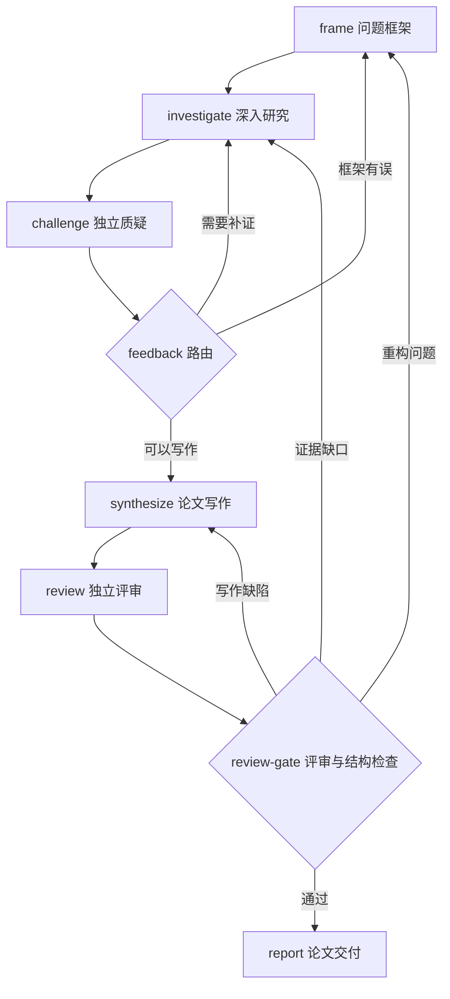

# Anchor 使用指南

本文描述当前已实现的行为。所有命令均从仓库根目录执行；返回 [项目入口](../README.md)。Plugin 的格式与边界见 [Plugin 设计](plugins.md)，知识库编译暂缓。

## 安装与首次启动

以下命令均从仓库根目录执行。

### 1. 准备环境

需要 Linux、Python 3.12+、Git、Bubblewrap（`bwrap`），以及支持 Vite 7 的 Node.js（20.19+ 或 22.12+）。沙箱需要宿主机允许创建相应 namespace；只有安装了 `bwrap`，不代表当前容器或主机一定允许它运行。

```bash
# Debian / Ubuntu：安装系统依赖；Python、Node.js 请另行准备
sudo apt-get install git bubblewrap

python3.12 -m venv .venv
./.venv/bin/python -m pip install -e '.[dev]'
npm --prefix apps/web ci
```

开发、测试和启动服务均使用项目的 `.venv`。如果出现 `No module named pydantic_ai`，先确认使用的解释器和依赖安装位置；PydanticAI 是当前 Agent Node 的正式依赖。

### 2. 配置模型

```bash
mkdir -p .local
cp -n examples/runtime.deepseek.json .local/runtime.json
```

配置文件的有效连接字段如下。`model` 必须是服务商支持的模型名；图中的 `models.academic` 引用这里的 `ref`。

```json
{
  "pilot_model": "models.academic",
  "models": [
    {
      "ref": "models.academic",
      "model": "deepseek-flash",
      "base_url": "https://api.deepseek.com/v1",
      "secret_ref": "DEEPSEEK_API_KEY"
    }
  ]
}
```

当前模型连接使用 OpenAI Chat Completions 兼容接口。密钥通过 `secret_ref` 解析，不写进图文件。可以在启动服务的终端中设置 `ANCHOR_SECRET_DEEPSEEK_API_KEY`；环境变量名称是 `ANCHOR_SECRET_` 加上 `secret_ref`。

也可以使用本地密钥文件：在 `.local/runtime.json` 中增加 `"secret_file": ".local/anchor-secrets.json"`，文件内容为 `{"DEEPSEEK_API_KEY": "你的密钥"}`，权限设为仅当前用户可读写：

```bash
chmod 600 .local/anchor-secrets.json
```

环境变量优先于密钥文件。相对密钥文件路径按进程工作目录解析，因此请从仓库根目录启动。`.local/` 已被 Git 忽略。

### 3. 放入一个工作流

开发服务读取 `.local/demo/workspaces/<图名>/graph.json`。首次使用可以复制深度学术调研示例：

```bash
mkdir -p .local/demo/workspaces/deep-academic-research
cp -n examples/graphs/deep-academic-research.json \
  .local/demo/workspaces/deep-academic-research/graph.json
```

示例文件与实际工作流是两份文件。修改 `examples/graphs/` 不会自动更新已创建的工作流；更新现有图应在 WebUI 中编辑，或明确修改它自己的 `graph.json`。

### 4. 启动后台服务

```bash
./scripts/dev.sh start
./scripts/dev.sh status
```

打开 **http://127.0.0.1:5173**。选择工作流，修改目标并保存，再点击“运行工作流”。

| 服务或文件 | 位置 |
| --- | --- |
| WebUI（Vite） | `http://127.0.0.1:5173` |
| API | `http://127.0.0.1:8077` |
| 工作流与运行数据 | `.local/demo/workspaces/` |
| API 日志 | `.local/dev/anchor-serve.log` |
| WebUI 日志 | `.local/dev/vite.log` |
| 进程 PID 文件 | `.local/dev/` |

## Anchor Pilot 与 Session API

点击顶部「Pilot」可创建可恢复的对话。Session 是长期对话，不是一次 Graph Run；PydanticAI 使用运行配置中的 `pilot_model`（若未配置则取首个模型）回答，对话消息由 Harness 保存，Anchor 记录生命周期和事件。可在 `.local/runtime.json` 顶层设置 `pilot_model`，模型连接信息不写入 Session 或 Graph。

Pilot 可以通过显式控制工具操作 Anchor 资源；模型不能绕过 Scheduler 的校验。查询、启动和运行控制会复用现有 Graph/Run/Plugin 文件事实。Graph 创建、修改、删除和 Run 的启动与控制标为需要审批，模型调用它们时当次运行立即结束并停在等待状态：待确认记录保存框架给出的 `tool_call_id` 和原始参数，未确认前工具不会执行。用户确认或拒绝后，客户端发起一次 `resume` turn 让同一调用继续；批准由框架用原参数执行该工具，拒绝作为工具结果返回给模型。已确认的调用由操作账本保证只执行一次，重放或中断后重试返回已记录结果。API 也提供：

```text
GET    /sessions
POST   /sessions                 {"id": "可选的稳定 ID"}
GET    /sessions/<id>
GET    /sessions/<id>/messages
GET    /sessions/<id>/events
POST   /sessions/<id>/turns      {"request_id": "稳定提交 ID", "message": "用户输入"}
POST   /sessions/<id>/turns      {"request_id": "新的恢复尝试 ID", "resume": true}
GET    /sessions/<id>/turns      # turn 列表，不含模型消息
GET    /sessions/<id>/turns/<turn>/events   # text/event-stream
POST   /sessions/<id>/stop       # 显式取消当前执行
POST   /sessions/<id>/status     {"status": "active|waiting_user|interrupted|archived", "reason": "可选"}
POST   /sessions/<id>/confirm    {"action": "待确认动作", "approval_key": "待确认记录的 tool_call_id"}
POST   /sessions/<id>/reject     {"action": "待确认动作", "approval_key": "待确认记录的 tool_call_id"}
POST   /sessions/<id>/runs       {"run": "已有的 run ID"}
POST   /sessions/<id>/messages  {"message": "用户输入"}   # 保留的同步入口
POST   /sessions/<id>/resume    # 保留的同步续答入口
DELETE /sessions/<id>
```

交互式调用方使用 turn API。`request_id` 由客户端生成并在网络重试时复用：同一 Session 下同 ID、同内容返回已存在的 turn 而不重复调用模型；同 ID、不同内容返回 409；同一 Session 同时只接受一个运行中的 turn。执行在服务端后台进行，浏览器断开连接不会取消任务。

`GET /sessions/<id>/turns/<turn>/events` 返回 SSE：`id` 是事件游标，`data` 是 PydanticAI 的 Vercel AI chunk（文本增量、工具输入/输出等），终态另发一个 `turn` 命名事件。恢复连接时带 `Last-Event-ID` 或 `?after=<序号>`，服务端只补发游标之后的记录；浏览器重连同样会跳过已收到的序号，因此不会重复追加上下文。非法游标返回 400，跨 Session 读取 turn 返回 404。

用户输入在模型调用前写入 Harness；首条输入的前 60 个字符用作会话标题。回复支持 Markdown、代码高亮、表格和复制；可搜索标题，浏览器保留当前会话和未发送草稿。输入支持中文输入法，Enter 发送、Shift + Enter 换行。

Pilot 需要补充信息时会调用 `session_ask`，该调用被推迟为外部执行，本次运行立即结束、turn 停在 `waiting_user`，问题写入 Session 的 `waiting_reason`。用户下一条消息就是这次调用的结果：它以工具返回值回到模型，而不是另起一轮用户发言，所以模型看到的是自己对问题的答复。Provider 失败或用户停止时 Session 标为 `interrupted`，已生成的增量文本保留在 turn 事件里，可通过「继续上次回复」发起一次新的执行身份。服务重启会把遗留的 `running` turn 标为 `interrupted` 并保留记录，不自动重放。删除前必须先将 Session 置为 `archived` 或 `interrupted`；删除会同时清理 Anchor Session 目录和 Harness 对话。完整能力与剩余缺口见 [Pilot 体验核查](pilot-experience-audit.md)。

**后续开发统一使用这个脚本管理服务**，不要依赖对话框或终端里的前台进程：

```bash
./scripts/dev.sh status
./scripts/dev.sh stop
./scripts/dev.sh restart
```

脚本使用 `nohup` 和 `setsid` 脱离启动终端，关闭终端或对话框不会关闭 Anchor。它不是系统服务管理器，不提供开机自启或进程崩溃后的自动拉起。

前端开发修改由 Vite 加载；Python 后端修改需要重启 API，使用上述 `restart` 会同时重启两个服务。**重启会中断正在执行的节点**；服务启动时会尝试恢复磁盘上仍标记为 `running` 的运行，能否安全恢复取决于节点记录。

如只需构建后的界面：

```bash
npm --prefix apps/web run build
```

`anchor-serve` 会在构建目录存在时提供静态界面，可通过 API 端口访问。自定义数据目录、配置和端口的入口为：

```bash
./.venv/bin/anchor-serve --root /path/to/anchor-data \
  --config /path/to/runtime.json --host 127.0.0.1 --port 8077
```

## WebUI 的使用方式

**图编排**：左侧用于搜索、新建和选择工作流，中间编辑拓扑，右侧修改图、角色或选中节点的属性。保存会调用后端校验；未保存的修改不能直接运行，切换图时会提示是否放弃修改。导入 JSON 是替换当前编辑内容，仍需保存。

编排和运行记录共用画布、节点尺寸、端口与连线路径。自动布局使用 ELK Layered 从上到下排列并正交路由，每条边有独立端口；前向连接从底部输出、顶部输入，循环返回按入口遍历识别，安排在节点右侧。运行只叠加状态和执行次数：已走过的边（包括反馈边）为加粗实线，未走过的边为虚线。轮询不会改变布局。

已有手动位置会保留，拖动结束后由 libavoid 对整图重新避障路由；拖动过程中暂时隐藏连线。点击「自动整理」重新生成布局，支持撤销，保存后生效；适配视图包含回路和标签。选中边可编辑「分支说明」，它保存在 `layout.edgeLabels`（键为 `起点|终点`），位置保存在 `layout.positions`，都只影响显示，不改变调度条件。节点重叠或空间不足的手动布局建议自动整理；复杂图仍可能有必要的交叉。

**工作流管理**：每行的 `⋯` 只管理这一行的图，不需要切换当前编辑对象。桌面悬停或键盘聚焦时显示入口，触屏常显。删除确认会显示图名及删除范围，默认聚焦“取消”。删除另一个图不会丢失当前未保存的编辑。

**运行记录**：选择一次运行，再点击节点查看对话、工具结果和文件。界面通过轮询更新状态；它不是与节点交互的聊天入口，也不是逐 token 的流式聊天。

| 操作 | 行为 |
| --- | --- |
| 暂停 | 当前节点结束后暂停调度 |
| 继续 | 尝试接着原运行执行，不创建新的运行 |
| 停止 | 请求取消当前模型调用或沙箱命令，并停止调度；不必等待节点正常提交 |
| 删除运行记录 | 永久删除该次运行的状态、工作区、Git 历史、对话和其他相关文件 |
| 删除工作流 | 永久删除该图的整个目录，包括图定义和所有运行记录及文件 |

停止是异步取消，后台退出和界面状态更新需要短暂时间。停止请求一旦发出，被取消的节点不会再向模型发出下一次请求，也不会把被杀的沙箱命令当成一次失败重试，最终结果固定报告为「stopped on request」，而不是重试耗尽之类的原因。后端在工作线程退出前仍将图视为运行中，期间拒绝删除。删除没有回收站。

## 图、节点与反馈循环

一个最小 Agent 图如下：

```json
{
  "objective": "解释检索增强生成的核心机制与适用边界",
  "agents": {
    "writer": {
      "model": "models.academic",
      "writes": ["answer.md"],
      "instructions": "在 answer.md 中回答问题，明确不确定之处。完成时返回包含 summary 的结构化结果。"
    }
  },
  "nodes": [{"id": "write", "agent": "writer"}],
  "edges": []
}
```

节点有三种声明方式：

| 声明 | 执行方式 |
| --- | --- |
| `{"id": "write", "agent": "writer"}` | Agent Node：模型在自己的工作区中通过 shell 工具完成任务 |
| `{"id": "check", "op": "structure"}` | Op Node：在同样的沙箱中执行一条命令，用退出码判断执行结果 |
| `{"id": "write", "graph": "revision"}` | 子图：运行前展开为普通节点，例如 `write/draft`、`write/review` |

`agents`、`ops` 和可复用的 `graphs` 在文件中声明。节点可以通过 `with` 补充本次使用的指令。子图的 `entry` 和 `exit` 决定外部连线连接的位置；不允许递归包含自身，但执行上的反馈循环是允许的。

Agent 和 Op 都可声明 `reads`、`writes`。加载时会检查声明的读取内容是否存在可达的生产者；这不是对研究结论真实性或产物质量的自动证明。

Agent 完成一轮必须返回明确的结构化结果，不能仅回复“已完成”。结果包含 `summary`；有多个出口时还必须包含一个合法的 `route`。

有多个出口时必须选择合法的后继节点。Op 的非零退出码表示失败；需要分支的检查节点应把检查结论写入文件，再由 Op 的既有路由协议选择回流或前进，而不是用失败退出码冒充反馈。

反馈边再次激活节点时，它继续使用本次运行中自己的工作区，读取新反馈，在已有成果上修订，然后留下新的 commit。新一轮是新的节点对话，文件和 Git 历史承担跨轮次的连续性。

### 研究进度不由固定轮数决定

省略图的 `max_rounds`，以及省略 Agent 的 `max_steps` 或将其设为 `null`，都不会设置执行次数上限。深度学术调研示例使用这种方式，让证据、反馈和完成标准决定何时结束。

这些可选字段仍可被显式设置；`max_steps: 0` 表示不允许模型请求。恢复不会清空已经消耗的显式预算，也不会因新配置省略上限而抹掉已持久化的限制。

这不等于所有限制都已移除：当前单条命令有超时，异常模型输出有重试处理，调度器还保留同一节点轮次最多启动 4 次的恢复尝试上限（`MAX_ATTEMPTS`）。后者是现有实现边界，不能据此宣称复杂任务可以无条件无限恢复。

## 工作区、Git 与运行之间的关系

**每次新运行有独立的运行目录和节点工作区，不会自动继承上一条运行历史。** 同一运行里的多轮执行复用节点工作区；恢复原运行也使用原目录。

```text
<服务 root>/workspaces/<图名>/
  graph.json                    当前可编辑的图定义
  runs/<run id>/
    run.json                    调度状态、轮次、路由、输入及 commit 记录
    graph.json                  本次执行写出的图副本，子图已展开
    <node>/                     节点工作区，包含自己的 .git
    control/<node>/             节点恢复、预算与完成记录
    .views/<node>-<commit>/      按指定 commit 导出的输入文件树
    <node>.trace.jsonl           第一轮对话与工具轨迹
    <node>-2.trace.jsonl         第二轮轨迹，以此类推
```

节点在沙箱内写 `/workspace`，读取 `/in/<上游节点>`。Anchor 在沙箱外将一轮执行留下的工作冻结为 Git commit，记录输入来自哪个节点、哪个 commit；节点能读 Git 历史，但自己的 `.git` 在沙箱内是只读的，不应自行提交或改写历史。

**边传递的是 commit 引用，不是把上游文件混入下游工作区。** 运行时仍需要通过 `git archive` 将对应 commit 的文件树导出到 `.views/`，再以只读方式挂载，因此不能把这一机制称为物理上的“零复制”。上游之后继续修改，不会改变已经指定的输入文件树；这保证输入可追溯，不保证模型输出确定性。

下游默认读取快照，必要时可查询该输入 commit 及其祖先的历史；快照内 `.git` 的 HEAD 固定在输入 commit，不暴露上游后续提交或无关分支。例如，上游节点为 `research` 时：

```bash
git --git-dir=/in/research/.git log --oneline
git --git-dir=/in/research/.git show <commit>:notes.md
git --git-dir=/in/research/.git diff <older-commit> HEAD
```

这份历史同样只读，无需也不能向上游提交修改。旧运行的空历史缓存在恢复并再次挂载时自动补齐。

下游除了直接输入，还可读取这些输入沿前向依赖关联的上游成果。追溯在反馈边处停止，避免把历次循环全部重新挂载；同一节点只保留一个输入挂载，直接输入优先，其余按执行记录选择较新的轮次。

### 沙箱和工具

所有节点命令通过 Bubblewrap 执行。节点的工作区可写，输入和挂载的系统、工具目录只读；另有临时目录。默认禁用网络，需在 Agent 或 Op 定义中明确设置 `"network": true`。沙箱不可用时不会退回宿主机裸执行。

学术调研工具不是专用 Agent 内核，而是 `academic-research` Plugin 注册的共享工具。深度学术调研图将它挂载给 investigator、challenger 和 reviewer；这些 AgentNode 通过显式入口调用登记工具。具体调用链见 [当前架构](architecture.md)。

以下是节点沙箱内的调用方式；在宿主机手动使用时，将命令名换成 `./.venv/bin/anchor-scholarly`。

```bash
anchor-scholarly sources
anchor-scholarly search --query "retrieval augmented generation evaluation" --source crossref --limit 8
anchor-scholarly search-many --queries-file queries.txt --budget 420
anchor-scholarly read --url "https://arxiv.org/pdf/2005.11401"
anchor-scholarly read-many --urls "https://arxiv.org/abs/2005.11401,https://arxiv.org/pdf/2005.11401"
anchor-scholarly citations --identifier 2005.11401 --direction cited_by
```

搜索源包括 Crossref、arXiv、OpenAlex。结果写入标准输出的 JSON；失败以非零退出码和标准错误报告。长文阅读需使用返回的 `next_offset`、`next_page_start`，分别传给 `--offset`、`--page-start` 继续读取。来源可能限流、拒绝访问或无法提供全文，研究节点需要据此调整策略。

## Plugin 的准备与使用

Plugin 由文件维护，WebUI 负责浏览、只读查看与挂载。先准备共享工具，再登记 Plugin。以下示例复用当前已安装的 Anchor 环境，不新建节点专用环境；从仓库根目录执行：

```bash
mkdir -p .local/demo/library/plugins .local/demo/library/tools/scholarly
ln -s "$PWD/plugins/academic-research" .local/demo/library/plugins/academic-research
```

如果该 Plugin 已登记，不重复创建链接，也不覆盖已有资源。编辑 `.local/demo/library/tools/scholarly/tool.json`，填写本机绝对路径；例如仓库位于 `/root/Anchor` 时：

```json
{
  "entrypoint": "/root/Anchor/.venv/bin/anchor-scholarly",
  "environment": "/root/Anchor/.venv",
  "imports": ["/root/Anchor/src"]
}
```

`imports` 用于 editable 安装；常规安装进独立工具环境时不必提供项目源码。其他工具可以使用自己的环境，具体字段见 Plugin 设计。

检查资源后再在 UI 中挂载：

```bash
./.venv/bin/python -m anchor.library --root .local/demo check academic-research
./.venv/bin/python -m anchor.library --root .local/demo list
```

在图编排中选中 AgentNode，刷新 Plugin 列表、查看说明、勾选能力并保存。新示例为 [plugin-research.json](../examples/graphs/plugin-research.json)。旧图不会自动获得 Plugin；已有研究工作流的节点配置由用户明确选择，不自动迁移运行历史。

服务默认使用 `<root>/library`。CLI 对 `<root>/workspaces/<graph>` 自动找到相同位置；独立目录运行时可用 `anchor-graph ... --library /absolute/path/to/library` 指定。资源不可用时修正库中的定义，不在节点工作区补装另一份。

运行详情中的 Plugin 页显示本次解析记录。共享说明和工具在运行期间保持不变；修改资源后开始新运行。这个记录不等于工具调用清单，实际命令在对话中查看。

## 深度学术调研图

当前示例是 [deep-academic-research.json](../examples/graphs/deep-academic-research.json)。它把研究认知保存在可修订的工作文件中，由质疑和评审决定下一步，而不是预设搜索若干次后直接拼接报告。



- `frame` 首次形成待验证的框架，默认不联网；回访时根据研究与反馈修正问题。首次没有 `/in` 输入是正常的，不能把这一阶段的假设当成已验证结论。
- `investigate` 联网检索、阅读全文和引用链，维护 `research.md`、`sources.md` 与原始材料，记录解释及判断变化。
- `challenge` 独立寻找反例和竞争解释，先验收上一轮问题，再提出影响核心结论的阻断问题。
- `synthesize` 形成 `answer.md`，按问题和机制组织论证；`review` 核查论证、引用、边界以及旧问题是否解决。
- 两个 Op 路由节点将反馈送回能处理问题的节点；最终由 `report` 生成 `runs/<run id>/report/paper.md`。

论文要求包含标题、摘要、引言、调研方法、主题分析、比较分析、开放问题、有效性威胁、结论和参考文献。结构检查验证章节是否存在，不能代替学术评审；自动化测试验证反馈送达、路由和产物结构，不证明真实论文质量。

收敛标准是核心问题得到有证据的回答、重要反例被处理、主张强度与证据一致。可选润色或无关扩展不应阻断交付；证据不足时允许限定或撤回主张，不要求消灭所有未知。

## 命令行、恢复与 HTTP API

### 直接运行与恢复

`anchor-graph` 接收**包含 `graph.json` 的目录**，不是 JSON 文件路径：

```bash
./.venv/bin/anchor-graph .local/demo/workspaces/deep-academic-research \
  --config .local/runtime.json --objective "你的研究问题"

./.venv/bin/anchor-graph .local/demo/workspaces/deep-academic-research \
  --config .local/runtime.json \
  --resume .local/demo/workspaces/deep-academic-research/runs/你的运行ID
```

不要在服务正运行同一个图时再用 CLI 启动它；CLI 不参与服务内的互斥调度。

恢复会同时读取图调度记录和节点持久化记录。无法判断命令是否已经产生副作用时，会报告不确定或失败，不自动猜测并重跑；中断的 Op 尤其不能承诺无条件恢复。服务启动只自动尝试恢复仍标记为 `running` 的记录，不会自动重启已经暂停、停止或失败的研究。

恢复仍加载工作流目录中的当前 `graph.json`。带 Plugin 的新运行核对图定义和资源摘要，变化时拒绝继续并保留旧记录；无 Plugin 的兼容路径仍会重写展开副本。需要继续旧运行时，不要先修改该工作流的结构或共享资源。

### HTTP API

开发环境基址为 `http://127.0.0.1:8077`。同一图一次只运行一个任务，重复触发返回 `409`；不同图可以同时运行，每个图内部目前串行调度节点。

| 方法与路径 | 用途 |
| --- | --- |
| `GET /plugins` | 列出共享 Plugin 及可用状态 |
| `GET /plugins/<id>` | 只读查看当前 Plugin 说明与工具入口 |
| `GET /plugins/<id>/files/<path>` | 读取或下载 Plugin 内的说明与补充文件 |
| `GET /graphs` | 工作流列表与运行状态 |
| `POST /graphs` | 创建工作流，参数为 `name` 和可选的 `definition` |
| `GET /graphs/<name>` | 读取图定义 |
| `PUT /graphs/<name>` | 校验并保存 `definition`，运行中拒绝修改 |
| `DELETE /graphs/<name>` | 删除图及其全部运行数据，运行中拒绝 |
| `POST /trigger` | 用 `graph` 和可选的 `objective` 启动运行，返回运行 ID |
| `GET /runs` | 列出运行记录 |
| `GET /runs/<id>` | 读取运行状态与节点轨迹摘要 |
| `POST /runs/<id>/pause` | 请求节点完成后暂停 |
| `POST /runs/<id>/stop` | 请求取消当前执行并停止 |
| `POST /runs/<id>/resume` | 尝试继续原运行 |
| `DELETE /runs/<id>` | 删除该次运行及文件，运行中拒绝 |
| `GET /runs/<id>/files/<node>` | 列出节点产物 |
| `GET /runs/<id>/files/<node>/<path>` | 预览文件，加 `?download=1` 下载原文件 |
