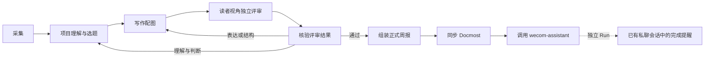

# 每周工作报告

`weekly-work-report` 使用 Anchor 现有定时器，每周四北京时间 09:00 运行。服务所在机器需保持 `Asia/Shanghai` 时区，并在计划时点运行 Anchor；停机或图正忙时不补跑。每次执行冻结截止时间，回顾此前七天；手动回看可传入 `input.end`，例如 `2026-10-01T09:00:00+08:00`。

图定义在 [weekly-work-report.json](../examples/graphs/weekly-work-report.json)。报告面向了解项目目标、未参与日常开发的负责人和协作同事。先理解项目目标与阶段，再提炼本周两三项实质变化、意义及下一步重点；不复述排查过程或按项目分组罗列日志。正文独立可读，不插来源编号；可核查依据单独保存在 sources.md。最后一个 `publish` 节点交付 `report.md`、`sources.md`、`assets/` 和评审记录；随后由挂载 Docmost Plugin 的 `docmost` 节点把正式稿同步到 Docmost 的 `MsteinL/Anchor周报` 父页面下，创建或更新以报告标题命名的子页面，并在 `docmost.json` 留下页面元数据。复制 publish 目录仍可离线阅读。

## 独立评审与反馈



评审节点使用与作者分开的模型上下文，直接核对只读稿件和当次证据；仍使用当前配置的同一模型，不等于不同模型交叉验证。评审先只读正文与图，写下读后记住的两三点和阅读障碍，再回查材料。四项标准依次关注项目意义与取舍、阶段判断、表达与配图、关键事实。准确但仍是流水账、缺乏项目理解或让读者抓不住重点，必须退回。检查最新记录与报告窗口，避免将计划写成成果或把周中状态当作周末现状。不能进行视觉检查时须如实说明核验方式和边界。

`review.md` 提供可阅读的判断与反馈；`review.json` 为每个阻断问题保留 ID、位置、可定位证据、业务影响、具体修法、验收条件及解决依据。复审必须逐项核销旧问题，不能删掉问题或不断换标准；纯润色建议不阻断。项目理解、选题及事实判断问题交回理解节点，表达和图示问题交回作者，在原稿上针对性修改，不重新采集或移动报告时间窗口。

普通 Op `gate` 调用 `anchor-rsi weekly-gate`，复用现有 `anchor-route` 分流。只有四项标准全部通过、没有未解决阻断项、旧问题逐项保留并给出解决依据，且评审对应当前稿件 Git commit，才能进入 `publish`；`weekly-publish` 在组装前再次核对该 commit。结构不合法、旧稿评审、遗漏旧问题或“带着阻断项通过”均失败，不生成正式报告。确定性检查由 Rust 业务模块执行，不依赖模型遵守提示词。

组装同时验证 Markdown 本地图片路径、普通文件和 SVG XML。图片必须在 `assets/`，拒绝路径穿越与符号链接；SVG 保留静态图表，拒绝 script、事件属性、foreignObject、外部 href、外部资源和不安全 CSS。报告、来源、图表及评审记录一并保留。

证据无法获得、记录冲突或无法视觉核验时，评审应在报告中明确限制、降低断言强度或把事项列为待核实；这类边界不会阻止周报交付。只有表达、事实组织或推理问题需要退回修订。不用固定修改轮数或分数阈值代替质量判断。上述门禁检查的是评审格式、状态及版本一致性，语义质量仍取决于评审判断，不能保证零错误。

理解节点交付内部编辑简报，说明项目背景、选题理由、应删去的琐事和全文主旨。写作节点按重要性组织正文，开篇给出主要判断，标题传递结论；发布到 Docmost 时去掉正文一级标题，避免和页面标题重复。写作要求使用同事之间汇报的具体、平实口吻，优先写清事实、对象、动作和结果，使用主动语态和直接动词，少用模板化转折、抽象名词和空泛总结；不强求每节采用相同结构或长度，重要事项展开，次要事项删减。篇幅通常约 1000–1800 中文字，但不以字数验收。配图解释项目现状、能力变化或关键关系，不画排查事件时间线。评审还要检查模板化开头、元话语、整齐的三段式和被动句，但不能按禁词数量机械判退；只有影响理解或掩盖真实取舍时才退回。反馈必须指出具体段落的阅读问题和可复述的验收条件，不能只要求“更有高度”或“去 AI 味”。

## 本机数据授权

历史来源是 `/root/.codex/sessions` 和 `/root/.dsh/sessions`。不读取认证配置或其他主目录内容。采集数据走本机只读授权，不通过 Plugin 暴露；Docmost 发布节点单独挂载 `docmost` Plugin。Graph 工作区的 `local-inputs.json` 由本机操作员授权，不能通过可编辑的 Graph JSON 或 API 申请宿主目录访问：

```json
{
  "collect": {
    "codex": "/root/.codex/sessions",
    "deepseek": "/root/.dsh/sessions",
    "rsi": "/opt/anchor/bin"
  },
  "gate": {"rsi": "/opt/anchor/bin"},
  "publish": {"rsi": "/opt/anchor/bin"}
}
```

只有 `collect` 节点能只读访问 `/local-inputs/codex` 和 `/local-inputs/deepseek`。三个业务 Op 的 `rsi` 授权目录包含原生 `anchor-rsi` 二进制；collect 调用 `weekly-collect`，后续节点只读取当次冻结证据，不直接访问本机历史目录。授权由操作员配置并按 Run 冻结，不能通过 Graph 自行扩大。

运行需要 `anchor-rsi`、Git 和现有沙箱 Shell/`anchor-route`；读取压缩 DSH 历史时还需要外部 `zstd -dc`，部署者应安装并授权该命令。普通 JSONL 不使用 zstd。Goose/provider 配置由服务环境提供。定时规则为 `{"type":"weekly","weekdays":[3],"time":"09:00"}`，通过现有 `/schedules` API 创建；安装到其他机器时重新配置来源目录及其时区，不重复创建相同计划。

## 证据边界

采集程序是只读的报告投影，不是历史恢复引擎。Codex 读取消息与工具记录；DSH 只选择各会话最新格式代际，避免迁移前后的重复。所有记录按事件时间纳入七天窗口，保留原始文件与 JSONL 行号。概览文本最多保留每条前 1800 字符，详细工具记录最多 4000 字符，截断均标明；关键结论须回查详细证据或原始只读记录。损坏记录、来源无本周活动与未验证状态必须如实披露。

不把模型隐藏推理、系统提示词或计费信息作为成果；常见凭证形式会脱敏，但不承诺正则覆盖所有私密信息。评审通过后，正式报告及配图会同步到指定的 Docmost 页面；来源清单、评审记录和其他 Run 产物保留在本机，不会自动发送到其他渠道。助手声称“完成”、工具执行成功、测试通过和真实 provider 验收是不同的证据等级。配图表达有证据支持的关系，不生成假截图或虚构指标。

Rust 本地定向验证入口为 `cargo test --manifest-path rust/Cargo.toml -p anchor-rsi --locked --test weekly`。它覆盖窗口、代际去重、脱敏与截断、评审状态、提交绑定、安全 SVG 和产物装配；不执行真实模型、Docmost 或企业微信。历史验收在开发台账保留，不能替代当前原生 Graph 的业务内容验收。

## Docmost 同步

`docmost` 节点只在评审通过并完成本地组装后运行，挂载仓库中的 Docmost Plugin 并允许网络访问。它按报告一级标题确定子页面标题，精确解析 `MsteinL` 空间和 `Anchor周报` 父页面；同名子页面只更新一份，不重复创建。报告中的 SVG 通过 Docmost 附件上传接口上传，并以图片链接插入页面；已存在同名报告时替换对应附件，避免重复堆积。图片上传失败会阻止页面更新。`docmost.json` 记录页面及附件元数据，离线报告仍保留 SVG、来源清单和评审记录。缺少 `DOCMOST_API_KEY`、目标不唯一或远端调用失败时，节点失败且不伪造成功记录。


## 企业微信完成提醒（本机配置）

需要完成提醒时，在本机 Graph 的 `docmost` 后连接 `notify-wecom`，以普通 `Op.call` 的 `detach` 模式调用 `wecom-assistant`。它绑定操作员确认的既有私聊 Session；Session 标识保存在本机 Graph 定义，不写入共享示例或由模型猜测。该能力沿用现有 Host 调用契约，不建立第二个 Runner。

调用只传递正式 `report.md` 和发布元数据 `docmost.json`。助手读取报告，生成含日期范围、主要进展和 Docmost 链接的简短正文，并保存 `weekly-report.md` 供后续会话追问。由通道网关投递终态答复时，节点指令应禁止重复调用主动发送工具。来源底稿、完整会话证据和评审记录不会随通知传递。

周报 Run 在通知目标持久接纳后即可结束；企业微信助手有自己的 Run、状态和投递记录。区分“调用已接纳”和“通知已完成”：Docmost 发布失败不会进入通知节点；通知失败也不会重跑周报或撤销已完成的 Docmost 发布。平台 ACK 不确定时不自动重发。当前原生 Graph 的真实发布和通知仍需独立业务验收。
